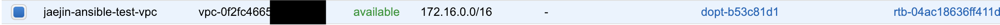
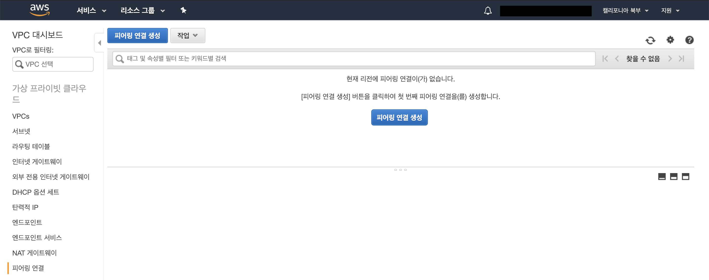
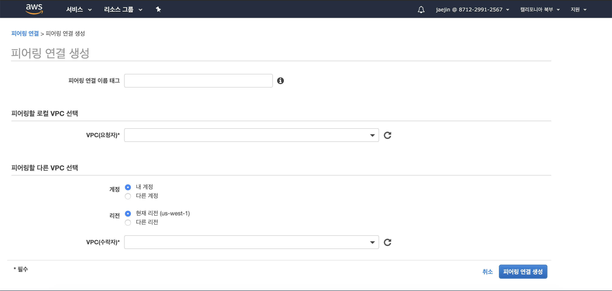
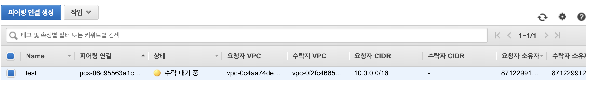
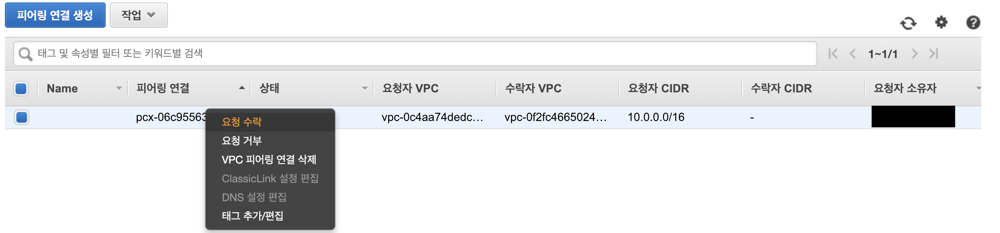
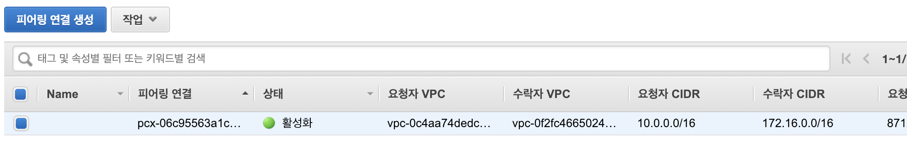
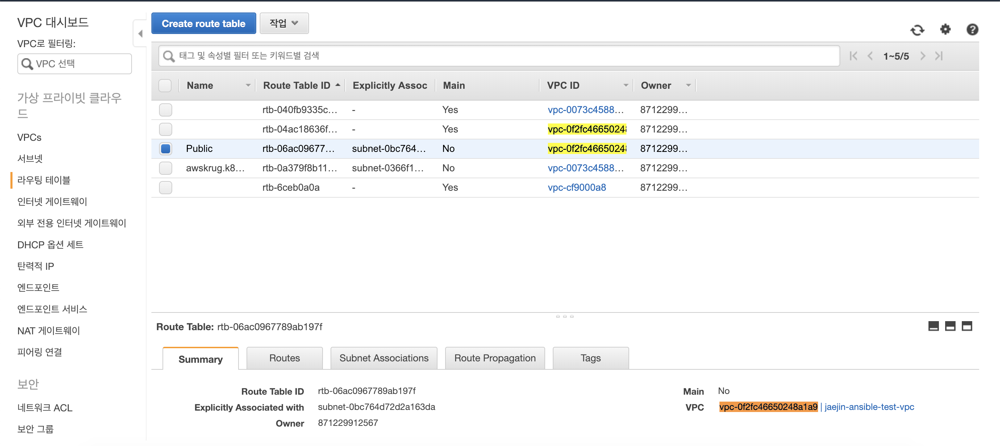
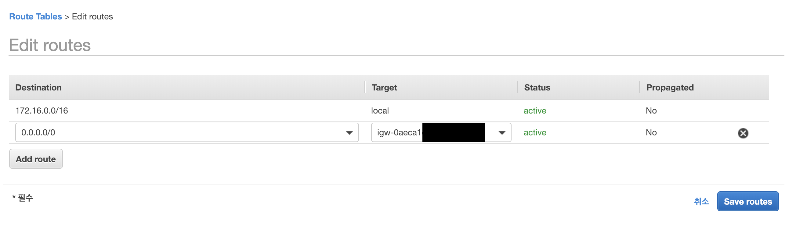
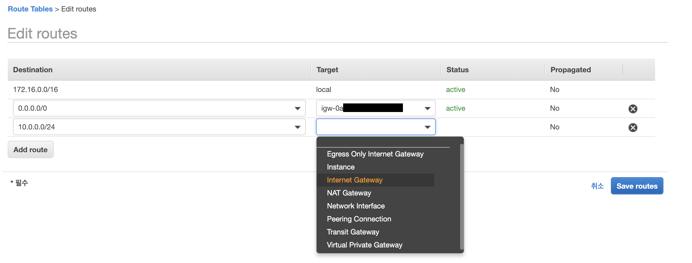

# Create aws vpc using ansible


Ansible을 공부하면서 AWS의 VPC를 생성해보고, peering까지 해보자.

<!--more-->

## vpc 설정

### Ansible playbook으로 VPC 생성

이번 글은 Ansible을 이용해 VPC를 생성하고 수동으로 VPC peering을 해보고자 한다.

[Set up your AWS VPC with Ansible 2.0](https://jeremievallee.com/2016/07/27/aws-vpc-ansible.html)

먼저 playbook을 다음과 같은 구조로 만들것이다.

~~~bash
├── playbook.yml
├── inventory
├── vars.yml
├── roles/
│   ├── vpc/
│   │   ├── tasks/
│   │   │   ├── main.yml
~~~

main파일인 playbook.yml 을 다음과 같이 정의한다.

```yaml

- hosts: local
    roles:
    - vpc
```

다음은 playbook을 실행할때 사용할 inventory file이다.

```yaml
[local]
localhost ansible_connection=local
```


[localhost -> localhost]: FAILED! => {"changed": false, "msg": "Python modules \"botocore\" or \"boto3\" are missing, please install both"}
이런 에러가 발생 할수도 있다. 이때는 inventory file을 변경해줘야한다.


~~~yaml
[local]
localhost

[webserver]
~~~

localhost 뒤에 추가 해줘야한다.

~~~yaml
[local]
localhost ansible_connection=local ansible_python_interpreter=python3.6

[webserver]
~~~

---


마지막으로 variables을 정의하자.

```yaml
---


## AWS Credentials
aws_access_key: "THISISMYAWSACCESSKEY"
aws_secret_key: "ThisIsMyAwSSecretKey"
aws_region:     "eu-west-1"

## VPC Information
vpc_name:       "My VPC"
vpc_cidr_block: "10.0.0.0/16"

## For Security Group Rule
#my_ip:          "X.X.X.X"

## Subnets
public_subnet_1_cidr:  "10.0.0.0/24"
```yaml

이제 VPC를 만들 파일을 만들어보자.

```yaml
---

# roles/vpc/tasks/main.yml


# First task : creating the VPC.
# We are using the variables set in the vars.yml file.
# The module gives us back its result,
# which contains information about our new VPC. 
# We register it in the variable my_vpc.

- name:               Create VPC
    ec2_vpc_net:
    name:             "{{ vpc_name }}"
    cidr_block:       "{{ vpc_cidr_block }}"
    region:           "{{ aws_region }}"
    aws_access_key:   "{{ aws_access_key }}"
    aws_secret_key:   "{{ aws_secret_key }}"
    state:            "present"
    register: my_vpc


# We now use the set_fact module 
# to save the id of the VPC in a new variable.

- name:               Set VPC ID in variable
    set_fact:
    vpc_id:           "{{ my_vpc.vpc.id }}"


# Creating our only Subnet in the VPC.
# A subnet needs to be located in an Availability Zone (or AZ).
# Again, we register the results in a variable for later.

- name:               Create Public Subnet
    ec2_vpc_subnet:
    state:            "present"
    vpc_id:           "{{ vpc_id }}"
    cidr:             "{{ public_subnet_1_cidr }}"
    az:               "{{ aws_region }}a"
    region:           "{{ aws_region }}"
    aws_access_key:   "{{ aws_access_key }}"
    aws_secret_key:   "{{ aws_secret_key }}"
    #map_public:       "yes" # vpc가 instance를 생성할때 자동으로 public ip를 할당하게 하는 옵션 ( default: false )
        resource_tags:
        Name:           "Public Subnet"
    register: my_public_subnet


# We save the id of the Public Subnet in a new variable.

- name:               Set Public Subnet ID in variable
    set_fact:
    public_subnet_id: "{{ my_public_subnet.subnet.id }}"


# Every VPC needs at least one Internet Gateway.
# This component allows traffic between the VPC and the outside world.

- name:               Create Internet Gateway for VPC
    ec2_vpc_igw:
    vpc_id:           "{{ vpc_id }}"
    region:           "{{ aws_region }}"
    aws_access_key:   "{{ aws_access_key }}"
    aws_secret_key:   "{{ aws_secret_key }}"
    state:            "present"
    register: my_vpc_igw


# We save the id of the Internet Gateway in a new variable.

- name:               Set Internet Gateway ID in variable
    set_fact:
    igw_id:           "{{ my_vpc_igw.gateway_id }}"


# Now we set up a Route Table. 
# We attach that Route Table to the Public Subnet.
# The route we create here defines the default routing 
# of the table, redirecting requests to the Internet Gateway. 
# We don't see it here, but the route table will also contain 
# a route for resources inside the VPC, so that if we need 
# to reach an internal resource, we don't go to the Internet
# Gateway.

- name:               Set up public subnet route table
    ec2_vpc_route_table:
    vpc_id:           "{{ vpc_id }}"
    region:           "{{ aws_region }}"
    aws_access_key:   "{{ aws_access_key }}"
    aws_secret_key:   "{{ aws_secret_key }}"
    tags:
        Name:           "Public"
    subnets:
        - "{{ public_subnet_id }}"
    routes:
        - dest:         "0.0.0.0/0"
        gateway_id:   "{{ igw_id }}"
```

이제 실행해보자.

~~~bash
$ ansible-playbook playbook.yml -i inventory -e @vars.yml

PLAY [local] ****************************************************************************************

TASK [Gathering Facts] ******************************************************************************
ok: [localhost]

TASK [vpc : Create VPC] *****************************************************************************
changed: [localhost]

TASK [vpc : Set VPC ID in variable] *****************************************************************
ok: [localhost]

TASK [vpc : Create Public Subnet] *******************************************************************
changed: [localhost]

TASK [vpc : Set Public Subnet ID in variable] *******************************************************
ok: [localhost]

TASK [vpc : Create Internet Gateway for VPC] ********************************************************
changed: [localhost]

TASK [vpc : Set Internet Gateway ID in variable] ****************************************************
ok: [localhost]

TASK [vpc : Set up public subnet route table] *******************************************************
changed: [localhost]

PLAY RECAP ******************************************************************************************
localhost                  : ok=8    changed=4    unreachable=0    failed=0
~~~

AWS에서 확인해보면 잘 생성된걸 볼 수 있다.



`peering` 을 하기 위해서 다른 리전에 vpc를 새로 생성했다. 위의  `vars.yml`  파일의 내용을 변경하면 된다.

1. aws_region  변경
2. vpc_cidr_block  변경
3. public_subnet_1_cidr 변경


peering을 하려면 겹치기 않게 CIDR 블록을 다르게 설정해야 한다. 위의 사진에서 생성한 VPC를 보면 두 개가 서로 다른 것을 볼 수 있다.

생성이 완료 되었으니 수동으로 peering을 해보자. 다음 글에서는 Ansible에서 peering까지 다뤄 볼 예정이다.

### Peering



AWS vpc에 들어오면 피어링 연결 목록이 있다.

생성을 누르고 설정을 해준다.



피어링 연결 이름 태그에는 이름을 써주고

로컬 VPC는 현재 접속중인 리전의 VPC를 선택한다.

피어링할 다른 VPC 선택 항목에서는 아까 다른 리전에 생성한 VPC를 써준다. 만약 다른 계정이라면 다른 계정을 선택. 현재 리전의 VPC 피어링도 가능하다.



상태가 수락 대기중이다. 연결 할 리전의 VPC에 들어가서 수락을 해준다.



수락하게 되면 상태가 활성화 되면서 연결에 성공하였다.



하지만 각 VPC에 연결된 Instance끼리 통신은 안될 것이다. 그 이유는 라우팅 테이블에 명시를 해줘야한다.

**라우팅 테이블**

왼쪽항목에 라우팅 테이블이 있고 선택하면 아까 생성한 VPC에 연결된 라우팅 테이블이 있을것이다.



선택을 하고 밑쪽에 Routes에 들어가 Edit routes를 클릭한다.



Add route를 선택하고 추가해준다.



internet Gateway를 선택하고 다른 리전에 있는 internet gateway의 ID를 입력해준다.

save하면 이제 통신이 잘 될것이다!!!
