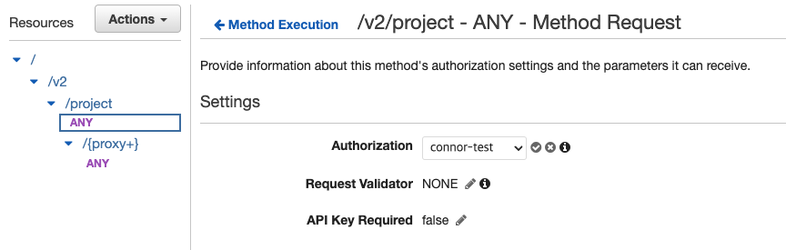

# API Gateway Authorizer


AWS Lambda로 끄적이다가 API Gateway를 붙여보자! 해서 보던 중 API Gateway는 인증 및 권한부여 기능을 제공 해주고 있었고 그 중 Authorizers의 존재를 봐서 api를 위한 Lambda 호출 전에 인증을 위한 Lambda를 호출 하는 것을 구성해봤다.

<!--more-->

### API Gateway authorizer

먼저 API Gateway는 요청에 대한 인증을 처리하기 위한 방법이 크게 2가지가 있다고 한다.

* authorizer lambda function 이용
    * token 기반
    * request 기반
* AWS Cognito를 이용하여 인증

cognito는 간단하게 써보기 위해서 굳이 사용하진 않을거고 lambda를 이용해보려고 한다.

token과 reuqest 차이는 authorizer lambda function에서 받는 `event 정보` 차이 이다. 

* token은 Authorization 정보만 event.AuthorizationToken으로 값이 들어오고
```go
type APIGatewayCustomAuthorizerRequest struct {
	Type               string `json:"type"`
	AuthorizationToken string `json:"authorizationToken"`
	MethodArn          string `json:"methodArn"`
}
```
* request는 HTTP header, pathParam, queryString등 여러가지 정보를 받을 수 있다. 즉 HTTP 요청 정보를 세세히 받을 수 있다고 보면 된다.
```go
type APIGatewayCustomAuthorizerRequestTypeRequest struct {
	Type                            string                                              `json:"type"`
	MethodArn                       string                                              `json:"methodArn"` //nolint: stylecheck
	Resource                        string                                              `json:"resource"`
	Path                            string                                              `json:"path"`
	HTTPMethod                      string                                              `json:"httpMethod"`
	Headers                         map[string]string                                   `json:"headers"`
	MultiValueHeaders               map[string][]string                                 `json:"multiValueHeaders"`
	QueryStringParameters           map[string]string                                   `json:"queryStringParameters"`
	MultiValueQueryStringParameters map[string][]string                                 `json:"multiValueQueryStringParameters"`
	PathParameters                  map[string]string                                   `json:"pathParameters"`
	StageVariables                  map[string]string                                   `json:"stageVariables"`
	RequestContext                  APIGatewayCustomAuthorizerRequestTypeRequestContext `json:"requestContext"`
}
```

일반적으로 많이사용하는 JWT인증의 경우 token 기반 인증으로도 충분하기 때문에 token 기반 인증으로 구성하고 사용해보려 한다.

#### authorizer 워크 플로우

AWS 공식 문서의 인증 워크플로우 그림을 보자.


1. 클라이언트가 요청을 보낼 때 token이나 request 파라미터 전달하고 API Gateway에서는 Lambda authorizer가 구성되어 있는지 확인한다.
2. authorizer가 Allow, Deny 여부를 판단해서 policy document를 반환한다.
3. Deny면 API Gateway에서 403을 반환하고 Allow면 각 method에 연결되어있는 서비스를 실행한다. 이때 authorizer의 cache 설정이 활성화 되어있다면 authorizer를 다시 실행하지 않도록 caching하여 비용을 절감할 수 있다.

### authorizer

#### lambda function

```go
func main() {
    lambda.Start(authorizerRequest)
}

func authorizerRequest(ctx context.Context, event events.APIGatewayCustomAuthorizerRequest) (events.APIGatewayCustomAuthorizerResponse, error) {
    // 인증 처리
    // ...
    //
    if (allow) {
        return generatePolicy("user", "Allow", event.MethodArn), nil
    } else {
        return generatePolicy("user", "Deny", event.MethodArn), nil
    }
}

func generatePolicy(principalId, effect, resource string) events.APIGatewayCustomAuthorizerResponse {
	authResponse := events.APIGatewayCustomAuthorizerResponse{PrincipalID: principalId}

	if effect != "" && resource != "" {
		authResponse.PolicyDocument = events.APIGatewayCustomAuthorizerPolicy{
			Version: "2012-10-17",
			Statement: []events.IAMPolicyStatement{
				{
					Action:   []string{"execute-api:Invoke"},
					Effect:   effect,
					Resource: []string{resource},
				},
			},
		}
	}

	// Optional output with custom properties of the String, Number or Boolean type.
	authResponse.Context = map[string]interface{}{
		"stringKey":  "stringval",
		"numberKey":  123,
		"booleanKey": true,
	}
	return authResponse
}
```

구성했던 전체 코드는 아니고 일부 코드이다. 인증로직은 JWT를 사용한다면 token 유효성 검사를 하는 부분 key file로 하거나 AWS KMS를 사용해서 유효하는지등의 작업을 하고 token이 정상적이라면 generatePolicy function에 ALLOW값을 넘겨주고 그게 아니라면 DENY를 넘겨서 return되게 구성했다.

token의 유효성에 따라 IAM Policy를 생성하면 된다. 이 때 resource에는 요청온 resource arn을 그대로 넣어주고 있는데, 여러개의 api를 사용하고 cache를 이용할 시 Resource 권한 문제로 이슈가 발생할 수 있으니 주의하자.

방법은 간단히 요청으로 받은 resource가 아닌 범위로 설정하여 return하면 될 것이다.

참고로 token기반이 아닌 request기반은 다음과 같이 처리 할 수 있다.

```go
func ValidateToken(ctx context.Context, token string) (events.APIGatewayCustomAuthorizerResponse, error) {

	apiGatewayProxyRequestContext, ok := core.GetAPIGatewayContextFromContext(ctx)

	if !ok {
		fmt.Println(apiGatewayProxyRequestContext)
	}

	region := "ap-northeast-2"
	effect := "Allow"
	principalId := "user"
	resource := fmt.Sprintf("arn:aws:execute-api:%s:%s:%s/%s/%s/%s",
		region,
		apiGatewayProxyRequestContext.AccountID,
		apiGatewayProxyRequestContext.APIID,
		apiGatewayProxyRequestContext.Stage,
		apiGatewayProxyRequestContext.HTTPMethod,
		"")

	authResponse := events.APIGatewayCustomAuthorizerResponse{PrincipalID: principalId}

	if resource != "" {
		authResponse.PolicyDocument = events.APIGatewayCustomAuthorizerPolicy{
			Version: "2012-10-17",
			Statement: []events.IAMPolicyStatement{
				{
					Action:   []string{"execute-api:Invoke"},
					Effect:   effect,
					Resource: []string{resource},
				},
			},
		}
	}

	// Optional output with custom properties of the String, Number or Boolean type.
	authResponse.Context = map[string]interface{}{
		"stringKey":  "stringval",
		"numberKey":  123,
		"booleanKey": true,
	}
	return authResponse, nil
}
```

#### 구성

이제 lambda는 위에 처럼 생성을 미리 해놓고 API Gateway의 authorizers를 설정해보자.


Token방식으로 설정하고, Source는 `Authorization`으로 했다.



api 호출시 인증이 필요한 method에 Authorization 설정을 생성한 것으로 설정한다.

#### 결과

이제 api 호출을 해보자.


auth값을 아무것도 넣어주지 않았을 때 API Gateway에서 401을 뱉고 있는 것을 볼 수 있다.


유효한 token을 넣어주고 authorizer lambda function에서 ALLOW를 넘겨줬다면? 요청한 Method가 정상적으로 호출 된 것을 볼 수 있다.

만약 token값이 유효하지 않아서 DENY를 return했다면?


API Gateway 403과 함께 deny된 메세지가 출력된다.

간단히 사용을 해보았는데 Lambda로 API구성을 한번 해보고 싶어서 어찌저찌 API Gateway까지 건들게 되서 authorizer를 사용해봤다.

기능적으로는 ELB뒤에 Lambda를 붙이는 것보다 API Gateway가 기능적으로 인증 및 권한과 요청 및 응답 매핑 정도가 있을 것 같은데 비용도 비싸기도 하고.. 실제 운영 환경에 적용할 때는 여러가지로 확인이 필요할듯 하다.

참고 할만한 페이지 https://serverless-training.com/articles/api-gateway-vs-application-load-balancer-technical-details/

---

**참고**

* https://docs.aws.amazon.com/ko_kr/apigateway/latest/developerguide/apigateway-use-lambda-authorizer.html
* https://lacti.github.io/2019/08/01/api-gateway-custom-authorizer/
