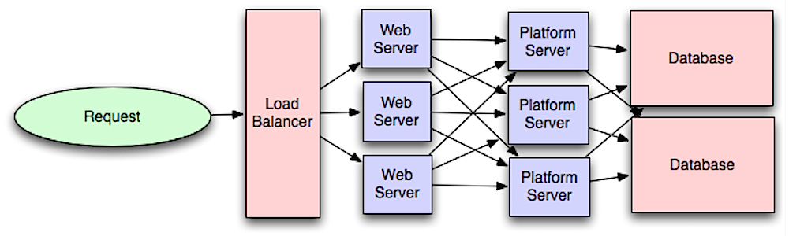

# Application Layer

<!--more-->

사실 참고하고 있는 페이지에서 주제는 application layer라고는 하지만 내용은 microservice에 대한 내용이 강한데.. 일단 있으니.. 

application layer에서 web layer를 분리하면 두 계층을 독립적으로 확장하고 구성할 수 있다.

새 API를 추가하면 web server를 추가하지 않아도 application server가 추가된다.

single responsibility principle은 함께 작동하는 소규모 및 자율 서비스를 advocates 한다.

작은 단위의 서비스를 갖추고 작은 팀은 빠른 성장을 위해 보다 적극적으로 계획 할 수 있다. 

---

**참고**

* https://github.com/donnemartin/system-design-primer#reverse-proxy-web-server
