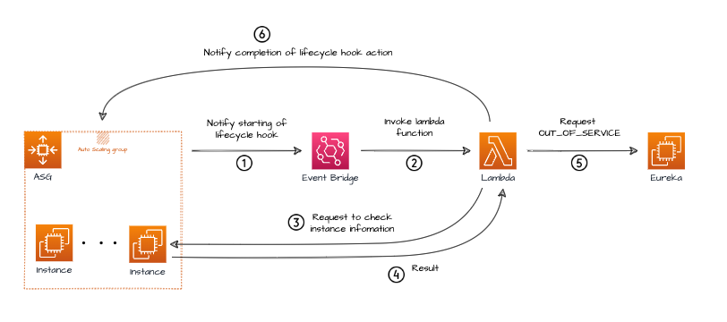
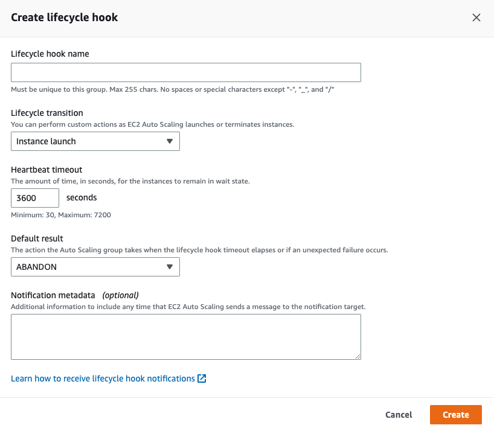

# ASG Lifecycle Hook


AWS Auto Scaling은 Lifecyle을 추가할 수 있는 기능을 제공한다.

Lifecycle 이벤트가 발생할 때 인스턴스에 대한 사용자 정의 작업을 수행할 수 있다.

<!--more-->

## Amazon EC2 Auto Scaling Lifecycle Hook

AWS EC2 ASG에서 인스턴스 시작 및 종료에 대한 이벤트를 잡아서 어떠한 작업을 수행하고 싶을 때가 있다.

예를 들어 

* ASG와 CodeDeploy가 설정되어 있고, ASG에서 Scale Out 이벤트가 발생 했을 때 CodeDeploy에서 배포가(인스턴스가 생성될 때 CodeDeploy 배포가 실행됨) 일어나기 전 어떤 스크립트를 실행하여 어플리케이션의 필요한 소프트웨어 패키지를 다운로드하여 트래픽 수신을 시작하기 전에 준비를 마치도록 할 수 있는 작업을 설정 할 수 있다.

* Sclae In 시점에 인스턴스가 종료되기 전 EventBridge로 인스턴스에 연결하여 종료되기 전에 로그파일을 다운로드 받는 로직을 추가할 수도 있고 Lambda를 이용해 추가 알림을 보낼 수 있는 작업을 할 수 있다.

AWS 문서에서 Lifecycle의 일반적인 용도는 인스턴스가 ELB에 등록되는 시점을 제어하는 것이라고 한다.

### Lifecycle Hook 작동 방식


출처 - https://github.com/donnemartin/system-design-primer#database


작동 방식은 aws 공식 문서에서 상세하게 안내하고 있다.
https://docs.aws.amazon.com/ko_kr/autoscaling/ec2/userguide/lifecycle-hooks-overview.html


### Lifecycle Hook 사용해보기

이제 이 Lifecycle을 이용할 간단한 예제를 만들어보자.

[service discovery](https://jaejin1.github.io/service-discovery-pattern/)로 eureka를 사용하고 있다고 가정해보자. 

scale out, in의 작업으로 인스턴스 상태에 따라서 eureka에 등록/삭제를 해줘야한다. 등록의 경우 인스턴스가 생성되고 프로스세가 생성된 이후에 등록 하면 되지만 eureka에 service out을 호출하지 않고 인스턴스가 삭제되면 graceful shutdown이 안될 수 있는 문제가 있다.

이를 Lifecycle Hook을 이용해 인스턴스가 삭제 되기전에 Lambda로 eureka로 service out 호출을 하는 것을 생각해보자.



ASG Lifecycle Hook 이벤트를 Event Bridge에서 Lambda로 보내고 Lambda에서 eureka로 out of service를 호출하는 간단한 아키텍쳐를 나타낸다.

#### Lifecycle Hook 생성



##### Heartbeat timeout

Heartbeat timeout은 Lifecycle Hook Action의 유지시간이다. 

Hook 이벤트를 받고 ASG쪽으로 completion 처리를 해줘야한다. 만약 별도로 처리 안하면 timeout 시간만큼 기다리게 된다.

##### Default result


|  | 인스턴스 시작 | 인스턴스 종료 |
|:---:|:---:|:---:|
| ABANDON | 사용자 정의 작업에 실패 했음을 나타내고, EC2 Auto Scaling이 인스턴스를 종료할 수 있음을 나타냄 | 인스턴스 종료를 허용. 그러나 남아있는 Lifecycle hook의 모든 작업 중지 |
| CONTINUE | 작업에 성공했고, EC2 Auto Scaling에서 인스턴스를 서비스 상태로 전환 할 수 있음 나타냄 | 인스턴스 종료를 허용. 남아있는 Lifecycle hook 모두 완료 |

#### 구성

##### Event Bridge

Event pattern 

```json
{
  "source": ["aws.autoscaling"],
  "detail-type": ["EC2 Instance-launch Lifecycle Action", "EC2 Instance-terminate Lifecycle Action"]
}
```

##### Lambda

AWS Lambda를 생성 후 IAM 권한에 `ASG CompleteLifecycleAction` 정책을 추가 해야한다.

```json
{
    "Version": "2012-10-17",
    "Statement": [
        {
            "Effect": "Allow",
            "Action": [
                "autoscaling:CompleteLifecycleAction"
            ],
            "Resource": "arn:aws:autoscaling:*:972467631093:autoScalingGroup:*:autoScalingGroupName/*"
        }
    ]
}
```

EventBridge에서 받은 event에 대해서 정보를 확인 하고 Eureka에 service out request를 호출 및 Slack 알림등의 작업을 한 후 

```json
{
  "version": "0",
  "id": "468fe059-f4b7-445f-bb22-2a271b94974d",
  "detail-type": "EC2 Instance-terminate Lifecycle Action",
  "source": "aws.autoscaling",
  "account": "123456789012",
  "time": "2015-12-22T18:43:48Z",
  "region": "us-east-1",
  "resources": [
    "arn:aws:autoscaling:us-east-1:123456789012:autoScalingGroup:59fcbb81-bd02-485d-80ce-563ef5b237bf:autoScalingGroupName/sampleASG"
  ],
  "detail": {
    "LifecycleActionToken": "630aa23f-48eb-45e7-aba6-799ea6093a0f",
    "AutoScalingGroupName": "sampleASG",
    "LifecycleHookName": "SampleLifecycleHook-6789",
    "EC2InstanceId": "i-004365c01913204a0",
    "LifecycleTransition": "autoscaling:EC2_INSTANCE_TERMINATING"
  }
}
```

ASG로 complete lifecycle action을 날려준다.

```python
def complete_lifecycle_action(event):
    client = boto3.client('autoscaling')
    response = client.complete_lifecycle_action(
        LifecycleHookName=event['detail']['LifecycleHookName'],
        LifecycleActionToken=event['detail']['LifecycleActionToken'],
        AutoScalingGroupName=event['detail']['AutoScalingGroupName'],
        LifecycleActionResult='CONTINUE',
        InstanceId=event['detail']['EC2InstanceId'])
```

이 작업은 위에 Heartbeat timeout 시간보다 빠르게 작동해야한다. 
ASG에서 complete lifecycle action을 받으면 인스턴스 종료를 시작하게 된다.

---

**참고**

* https://docs.aws.amazon.com/ko_kr/autoscaling/ec2/userguide/lifecycle-hooks.html
* https://docs.aws.amazon.com/ko_kr/autoscaling/ec2/userguide/lifecycle-hooks-overview.html
