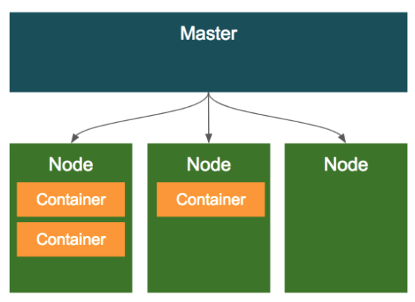

# Kubernetes basics

쿠버네티스의 클러스터 구조는 다음과 같다.

1. 클러스터 전체를 관리하는 컨트롤러로써 마스터가 존재한다.
2. 컨테이너가 배포되는 머신인 노드가 존재한다.

<!--more-->

`조대협님 블로그`

## 오브젝트

가장 기본적인 구성단위가 되는 기본 오브젝트와, 이 기본 오브젝트를 생성하고 관리하는 추가적인 기능을 가진 컨트롤러로 이루어진다. 그리고 이러한 오브젝트의 스펙 이외에 추가정보인 메타 정보들로 구성이 된다고 보면 된다.

### 오브젝트 스펙 ( object spec )

오브젝트들은 모두 오브젝트의 특성을 기술한 오브젝트 스펙으로 정의가 되고, 커맨드 라인을 통해서 오브젝트 생성시 인자로 전달하여 정의를 하거나 또는 yaml 이나 json 파일로 스펙을 정의할 수 있다.

### 기본 오브젝트 ( basic object )

쿠버네티스에 의해서 배포 및 관리되는 가장 기본적인 오브젝트는 컨테이너화되어 배포되는 애플리케이션의 워크로드를 기술하는 오브젝트로 `pod`, `service`, `volume`, `namespace` 4가지가 있다.

- pod → 컨테이너화된 애플리케이션
- volume → 디스크
- service → 로드밸런서
- namespace → 패키지명

정도로 생각하면된다.

## Pod

pod는 쿠버네티스에서 가장 기본적인 배포 단위로 컨테이너를 포함하는 단위이다.

~~~yaml
apiVersion: v1
kind: Pod
metadata:
    name: nginx
spec:
    containers:
    - name: nginx
    image: nginx:1.7.9
    ports:
    - containerPort: 8090
~~~

pod은 여러개의 컨테이너를 가질 수 있는데 왜 여러개로 나눠서 배포를 하냐?

- pod 내의 컨테이너는 IP와 port를 공유한다. 두개의 컨테이너가 하나의 pod를 통해서 배포되었을때 localhost를 통해서 통신이 가능하다.
- pod내에 배포된 컨테이너간에는 디스크 볼륨을 공유할 수 있다.

## volume

pod가 동작할때 디폴트로 컨테이너마다 로컬 디스크를 생성해서 기동되는데 영구적이지 못하다. 따라서 DB같이 영구적으로 파일을 저장해야 하는 경우에는 컨테이너 리스타트에 상관 없이 파일을 영속적으로 저장해야 하는데 이러한 형태를 볼륨이라한다.

쿠버네티스는 github같은 오픈소스 기반의 외장 스토리지를 지원한다..

## service

pod 경우에는 동적으로 생성되고 자동으로 리스타트가 되면서 IP가 바뀌기 때문에, 로드밸런서에서 pod의 목록을 지정할 떄는 IP주소를 이용하는 것은 어렵다. 따라서 유연하게 선택해줘야하는데 이것이 `라벨` 과 `라벨셀렉터` 라는 개념이다.

서비스를 정의할때 어떤 pod를 서비스로 묶을 것인지 정의하는데 이를 셀렉터라고 한다. 서비스는 라벨 셀렉터에서 특정 라벨을 가지고 있는 pod만 선택하여 서비스에 묶게 된다.

## name space

네임스페이스는 한 쿠버네티스 클러스터내의 논리적인 분리단위라고 보면 된다.

## 컨트롤러

앞의 4개의 기본오브젝트로 애플리케이션을 설정하고 배포하는 것이 가능하다. 이를 더 편하게 관리하기 위해 컨트롤러 라는 개념을 사용한다.

- Repication controller

    지정된 숫자로 pod를 기동 시키고 관리하는 역할을 한다.

- Replicaset

    replication controller의 새버전이라 생각하면된다.

- Deployment

    Replication controller와 Replica Set의 좀더 상위 추상화 개념이다. 실제 운영은 이를 많이 사용한다.

## 고급 컨트롤러

RC,RS,Deployment는 웹서버와 같은 일반적인 워크로드에 대해 pod를 관리하기 위한 컨트롤러이다. 실제 운영환경에서는 웹서버와 같은 일반적인 워크로드 이외에, 데이타베이스, 배치 작업, 데몬 서버와 같이 다양한 형태의 워크로드 모델이 존재한다.

### Daemonset

pod가 각각의 노드에서 하나씩만 돌게 하는 형태로 Pod를 관리하는 컨트롤러 이다.

RC나 RS에 의해서 관리되는 Pod는 여러 노드의 상황에 따라 일반적으로 비균등적으로 배포가 되지만, DS에 의해 관리되는 pod는 모든 노드에 균등하게 하나씩만 배포 된다.

이런 형태의 워크로드는 서버의 모니터링이나 로그 수집 용도로 많이 사용되는데, DS의 다른 특징중 하나는, 특정  Node들에만 Pod가 하나씩만 배포 되도록 설정이 가능하다.

또한 DS는 특정 노드에만 pod를 배포할 수 있도록, pod의 `node selector`를 이용해서 라벨을 이용하여 특정 노드만을 선택할 수 있게 지원한다.

### Job

워크로드 모델중에서 배치나 한번 실행되고 끝나는 형태의 작업이 있다.

예를 들어 원타임으로 파일 변환 작업을 하거나, 또는 주기적으로 ETL 배치 작업을 하는 경우에는 웹서버 처럼 계속 pod가 떠 있을 필요없이 작업할때만 pod를 띄우면된다. 

이를 지원하는 컨트롤러를 job이라한다.

Job을 정의할때는 보통 아래와 같이 컨테이너 스펙 부분에 image뿐만 아니라 컨테이너에서 Job을 수행하기 위한 커맨드를 입력한다.

~~~yaml

apiVersion: batch/v1
kind: Job
metadata:
    name: pi
spec:
    template:
    spec:
        containers:
        - name: pi
        image: perl
        command: ["perl",  "-Mbignum=bpi", "-wle", "print bpi(2000)"]
        restartPolicy: Never
    backoffLimit: 4

~~~

Job 컨트롤러에 의해서 실행된 pod는 command의 실행 결과에 따라서 job이 실패한지 성공한지를 판단한다.

만약 Job이 끝나기전에 비정상적으로 종료된다면?

RC/RS에 의해서 관리 되고 있다면 계속 생성될것이다. 

장애시 다시 시작하게 하거나 또는 장애시 다시 시작하지 않게 할 수 있다.

### Cron job

unix cron 처럼 시간에 따른 실행조건을 정의해놓을 수 있고, 이에 따라 job 컨트롤러를 실행하여, 정의된 pod를 실행할 수 있게 한다.

~~~yaml

apiVersion: batch/v1beta1
kind: CronJob
metadata:
    name: hello
spec:
    schedule: "*/1 * * * *"
    jobTemplate:
    spec:
        template:
        spec:
            containers:
            - name: hello
            image: busybox
            args:
            - /bin/sh
            - -c
            - date; echo Hello from the Kubernetes cluster
            restartPolicy: OnFailure
~~~

다른 점은 cronjob 스펙 설정 부분에 schedule 이라는 항목이 있고 반복 조건을 unix cron과 같이 설정하면 된다.

### Statefulset

RS/RC나 다른 컨트롤러로는 데이타베이스와 같이 상태를 가지는 애플리케이션을 관리하기가 어렵다. 그래서 이렇게 데이타 베이스등과 같이 상태를 가지고 있는 Pod를 지원하기 위해서 Statefulset이라는 것이 소개 되었는데 볼륨할때 다시 본다.
