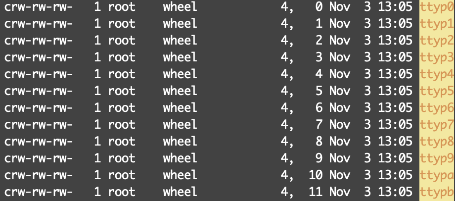

# Computer structure and socket

갑자기 컴퓨터 구조에 대해서 정리해보고 싶어서 머리속에 있는것을 더해 끄적여본다.

<!--more-->

대학교에서 전공과목으로 컴퓨터 구조를 배웠지만 생각이 나지 않고 뭘배웠는지 기억을 못한다...
그나마 남아있는것을 정리하려고한다.

ㅜㅜ..

컴퓨터는 가장 크게 H/W, S/W로 나눌 수 있고 이를 좀더 자세히 나눠서 보자

## H/W

말그대로 하드웨어 물리적인 컴퓨터 자원을 말한다. CPU, GPU, RAM등등 본체에 꼽혀있는것들..

## S/W

소프트웨어는 물리적 반대로 논리적(Logical)하다 라고 많이 불리고 이는 IT쪽에서 Virtual과 비슷한 의미를 가진다.

더 작게 나눠보자

### Kernel

커널은 운영체제의 핵심 부분으로서, 운영체제의 다른 부분 및 응용 프로그램 수행에 필요한 여러가지 서비스를 제공한다.

라고 위키백과에 나와있다. 

간단히 말하면 이 커널 영역에서 흔히 하드웨어 장치에 필요한 Driver가 있어야 하고, 그에 따른 구성요소가 포함된다고 보면 될 것 같다.

예를들어 Disk라는 물리적인 저장공간을 가지고있고 이에 따른 Driver가 있고 이 Driver는 File System(NTFS) 구성요소와 연결 되고, File System은 우리가 흔히 쓰는 File과 연결되어 처리가 된다. 

우리가 컴퓨터로 파일을 옮기고 삭제하는등의 행동을 취했을때 내부적으로는 File -> File System -> Driver -> Disk 또는 SSD등 이렇게 이뤄지는 것이당 File system부터 Disk까지의 행동을 커널 영역에서 다룬다.

음.. 다른 예를 하나더 들어보자. 제목에 socket을 넣어서 잠깐 다뤄보면

우리가 흔히 쓰는 Socket도 결국 위에서 말한 File을 이용한다. 이게 무슨? 소리징하고 처음엔 생각했다.

그 이유는 유닉스의 리소스 구성은 파일로 이뤄져있다. 파일, 하드웨어, 파이프, 소켓등등 밑의 사진을 보면 하드웨어들이 file로 저장되어 있는것을 볼 수 있다.

다시 Socket으로 돌아와서 커널 영역에서 뭘하는지 보면, Socket(file) -> Protocol(TCP/IP) -> Driver -> NIC 이렇게 될듯 하다. NIC는 하드웨어로 랜카드이다. TMI로 NIC -> L2 -> R -> internet이 되겠지요?

Kernel 영역에서 하는 일은 위의 예시들로 알 수 있을 것이다.

백신 프로그램을 잠깐 보면 어떻게 동작하는지 짐작 할 수 있을 것 같은데 아까 위에서 File -> 구성요소 -> Driver이렇게 흘러간다고 얘기를 많이 했다. 그 중간에 Filter라는 것이 존재하는데 이 Filter는 구성요서 앞/뒤 쯤 올 수 있다. 

이 Filter를 백신 업체에서 제공 해주면 Filtering이 되겠거니 싶다. 물론 Filter를 이용하다 보니 속도는 느려 질 수 있을 것이다.

### User

User영역은 아까 많이 언급한 File이 속한다. 

또한 백신 얘기할때 anti virus가 속할 수 있고 이 anti virus는 아까 Filter와 주거니 받거니 할 것이다.

### Process/Thread

가장 많이 접한 Process와 Thread이다. 

이 둘을 간단히 비교해보면 Process안에 Thread가 있고 `Thread는 프로세스 내에서 실행되는 여러 흐름의 단위`라고 구글에 검색하면 많이 나올 것이다.

엄청 간단히 예시를 들면 집(house)가 Process 그 안의 구성원 엄마, 아빠 등이 Thread라고 생각하면 될 것 같다.

Process끼리는 독립된 Memory를 가져서 서로 데이터 공유가 안된다. 물론 Thread는 Process 내에서 동작하기 때문에 Process내의 Thread끼리는 같은 메모리 공간을 이용한다. 따라서 동기화가 중요 하다 !

실생활의 예를 들어보면 집(process)에 내가(thread) 화장실을 사용하고 있을때 문을 잠그고 이용하게 되면 다른 가족구성원(thread)는 화장실을 사용하지 못한다. 만약, 문을 안잠그고 사용하다가 큰일을 보는 중에 문을 열어버린다던지 그러면 안되는 것 처럼 이해 하면 될 것 같다. 

여기서 화장실 문을 잠그는 행위는 Lock을 거는 행위이고 이는 mutex를 이용해 Lock, UnLock을 하는 것과 같다고 보면 될 듯 하다.

여기서 말한 Memory는 아 ~~ 까 말한 S/W는 Virtual == Logical 을 잠깐 인용하자면 Process에 할당된 Memory는 virtual memory이다.
