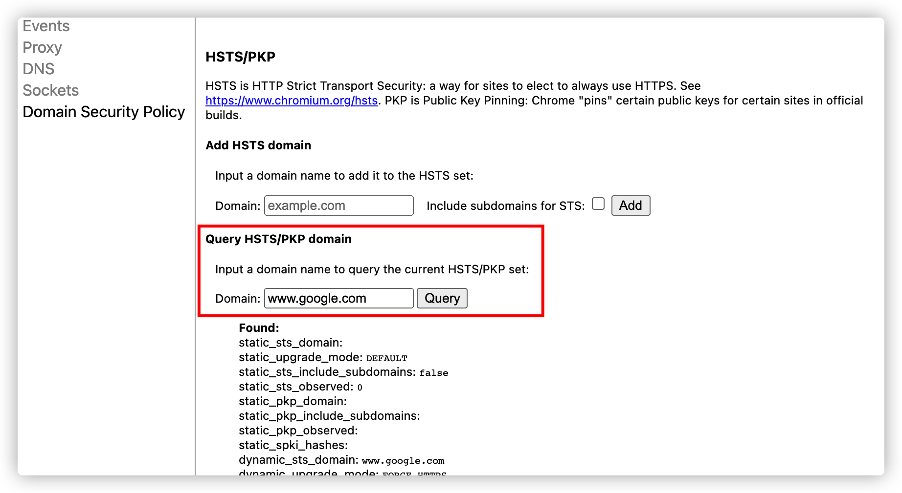
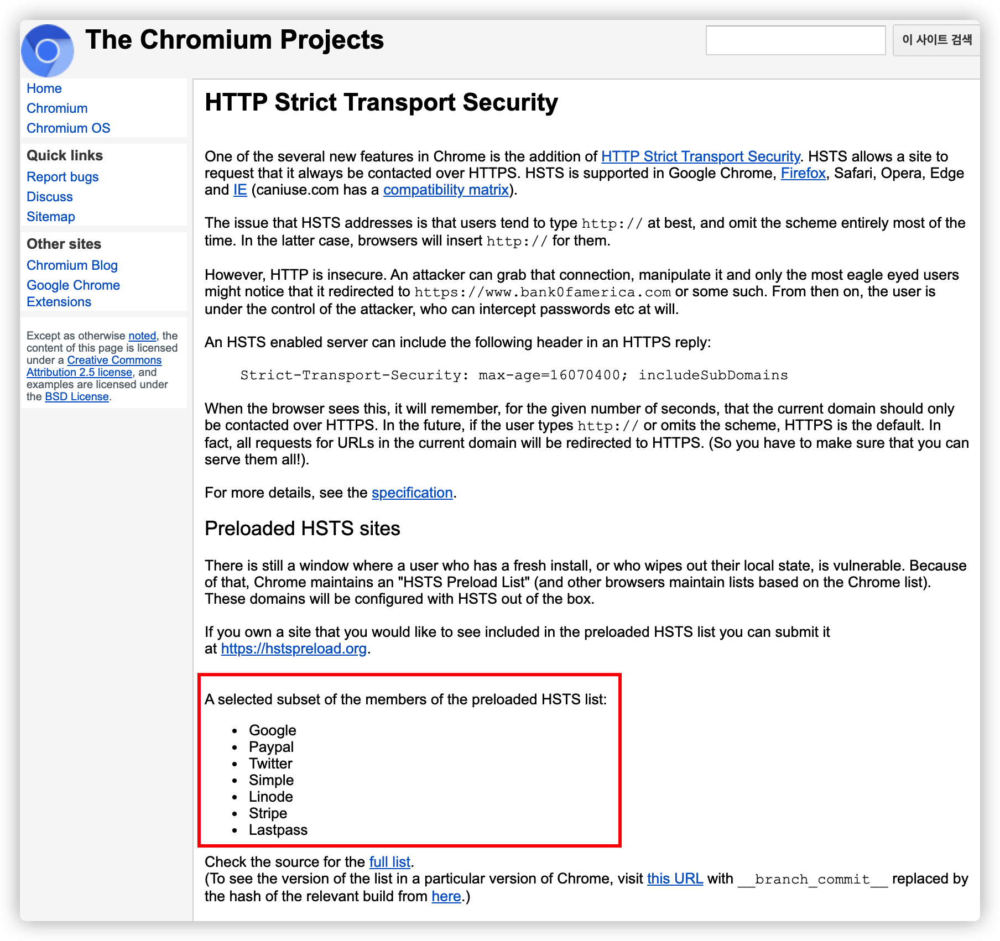
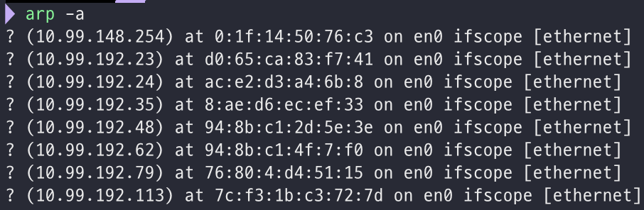

# browser에서 url을 입력하면 무슨일이 일어날까?


웹 browser에 url을 입력하면 무슨일이 일어날지 정리해보자.

<!--more-->

## url을 주소창에 친다.

browser가 url을 해석하고, url문법에 따라서 요청을 하는데 만약 문법이 틀리다면 웹 browser의 기본 검색엔진으로 검색 요청을 한다.

url의 문법은 [URL 위키백과](https://ko.wikipedia.org/wiki/URL#cite_note-3) 에 자세히 나와있다.

## HSTS(HTTP Strict Transport Security) 목록을 로드해서 확인한다.

HSTS 목록에 있으면 첫 요청을 HTTPS로 보내고, 아닌경우 밑의 설명과 같이 HTTP로 보내서 HSTS 설정을 가져온다. (설정이 없다면 뭐 HTTP로 통신할 것이다.)

### HSTS란 무엇인지 알아보자.

일반적으로 HTTPS를 강제하게 될 때 서버측에서 302 redirection을 이용해 전환시켜주는데 이것이 취약점이 될 수 있다고 한다.

`http요청 -> 서버에서 302 redirect -> 클라이언트에서 https 재요청 -> 200 found`

따라서 클라이언트에게 강제로 HTTPS를 사용하도록 권장되는데 이것이 HSTS이다.

클라이언트에서 강제하기 때문에 http를 이용한 연결 자체가 최초부터 시도되지 않으며 클라이언트 측에서 차단된다는 장점이 있다. 

`https요청 -> 200 found`

사용자가 최초로 사이트에 접속시도를 하게 되면 웹서버는 HSTS설정에 대한 정보를 browser에게 응답하게 된다. browser는 이 응답을 근거로 일정 시간동안 HSTS응답을 받은 웹사이트에 대해서 https접속을 강제화 하게 된다.

실제 Chrome에서는 `chrome://net-internals/#hsts` 주소에서 확인 할 수 있다. 



또한 몇가지 웹사이트들은 browser자체에 등록되어 있는데 이를 확인하는 주소는 다음과 같다.

https://www.chromium.org/hsts



### HSTS의 설정 방법

HSTS는 위에서 확인한 것과 같이 최초 요청은 서버에서 HSTS설정에 대한 정보를 가져 오기 때문에 서버에서 설정해 주어야 한다.

#### 예제

* apache httpd

> Header always set Strict-Transport-Security “max-age=86400; includeSubdomains; preload”

* nginx

> add_header Strict-Transport-Security “max-age=86400; includeSubdomains; preload”

설정을 보면 

* max-age=86400 : HSTS가 설정된 시간이며 초단위 이다.

* includeSubdomains : HSTS가 적용될 도메인의 subdomain까지 HSTS를 확장 적용함을 의미한다.

* preload : HSTS 적용이 클라이언트 측에서 preload로 이루어짐을 의미한다.

## DNS(Domain Name Server)를 조회한다.

1. DNS에 요청을 보내기 전에 먼저 browser에 해당 Domain이 cache돼 있는지 확인한다. DNS query가 이 곳에서 가장 먼저 실행된다.

또한 os 캐시를 확인하고, router 캐시를 확인하고 isp 캐시를 확인할 수도 있다.

2. 없을경우 local에 저장돼 있는 `/etc/hosts` 파일에서 참조할 수 있는 domain이 있는지 확인한다.

3. 1,2가 모두 실패 했을 경우 Network stack에 구성돼 있는 DNS로 요청을 보낸다. 

### DNS에 대해서 좀 더 자세히 알아보자.

DNS는 url들의 이름과 ip주소를 저장하고 있는 데이터 베이스이다. 모든 url들은 고유의 ip가 지정되어 있고 해당 ip를 통해서 서버에 접근할 수 있다.

ip를 확인하는 방법은 `nslookup www.google.com` 으로 확인할 수 있고 해당 ip를 browser에 쳐보면 google로 바로 접근 가능하다.

#### DNS로 요청을하면 해당 IP주소를 찾기위해서 동작하는 과정을 알아보자.

www.google.com과 같은 주소로 접속하고 싶으면 해당 ip를 반드시 알아야하는데, DNS query로 여러 다른 DNS 서버들을 검색해서 해당 사이트의 IP주소를 찾는 것이다. 

ip주소를 찾을 때 까지 DNS서버에서 다른 dns서버를 오가면서 반복적으로 검색한다.

이때 isp DNS서버를 DNS recursor라고 부른다. 

url들은 third-level, second-level, top-level domain을 가지고 있다. 각 level별로 자신만의 name서버가 있고 여기서 DNS lookup 프로세스 중에 query가 진행된다.

url로 접속하면 처음에 DNS recurser가 root name server에 접근한다. root name 서버는 `.com` 도메인 name server로 redirect한다. `.com` name server는 `google.com` name server로 redirect한다. `google.com` name server는 DNS 리스트에서 www.google.com에 매칭되는 IP주소를 찾고 DNS recursor로 보내게 된다.

이 요청들은 데이터 패킷들을 통해 보내진다. 패킷 안에는 요청의 내용과 DNS recursor의 ip주소가 포함되어 있다. 이 패킷들은 원하는 DNS 기록을 가진 DNS 서버에 도달할 때 까지 클라이언트와 서버를 여러번 왔다갔다한다. 패킷들이 움직이는 것도 routing table에 기반하고 패킷이 loss되면 request fail error가 발생한다. 

## ARP로 대상의 IP와 MAC address를 알아낸다.

ARP(Address Resolution Protocol)이란 논리적인 IP주소를 기반으로 물리적인 MAC주소로 바꾸어주는 주소 해석 프로토콜이다. 

### ARP 캐시 테이블

```bash
arp -a
```



`apr -a` 명령을 실행하면 IP와 MAC 주소의 대응 관계를 볼 수 있다. 이처럼 대응 관계를 저장한 테이블이 ARP 캐시 테이블이다. 

### 만일 APR캐시 테이블이 비어있는 경우

10.99.192.23이 출발지의 IP주소라고 생각해보자.

| 구분 | 출발지 | 목적지 |
|:---:|:---:|:---:|
| IP 주소 | 10.99.192.23 | 8.8.8.8 |
| MAC 주소 | d0:65:ca:83:f7:41 | |

ARP 캐시 테이블이 빈 상황에서 8.8.8.8에 접근하려할 시 운영체제는 출발지 네트워크 ID와 도착지 네트워크 ID를 비교한다. 

출발지는 10.99.192이지만 목적지는 8.8.8이므로 네트워크 ID가 다르다. 다른 LAN영역이기 때문에 목적지 IP 주소를 라우터 IP주소로 변경해야한다.

| 구분 | 출발지 | 목적지 |
|:---:|:---:|:---:|
| IP 주소 | 10.99.192.23 | 라우터 IP 주소 |
| MAC 주소 | d0:65:ca:83:f7:41 | |

동일한 LAN영역에 위치한 게이트웨이까지 스위칭 통신을 하기 위해 목적지 MAC 주소가 필요하다.

출발지 호스트는 자기가 속한 LAN 영역 전체를 대상으로 라우터 IP 주소에 대응하는 MAC주소를 찾기 위해 ARP질의를 브로드 캐스트 방식으로 전송한다.


| 구분 | 출발지 | 목적지 |
|:---:|:---:|:---:|
| IP 주소 | 10.99.192.23 | 라우터 IP 주소 |
| MAC 주소 | d0:65:ca:83:f7:41 | 26:7a:a:2f:bc:e2 |

이제 ARP 캐시 테이블에 목적지 MAC 주소가 올라오면 운영체제는 이를 참조해 전송할 데이터를 유니캐스트 방식으로 게이트웨이에 전송한다. 

이후, 게이트웨이가 IP주소에 기반한 라우팅 통신을 통해 목적지 호스트가 있는 게이트웨이로 데이터를 전송한다.

이처럼 ARP 요청과 응답이 일어나는 공간을 ARP영역이라 하며, ARP 동작은 동일한 네트워크 ID를 공유하는 호스트를 대상으로 MAC 주소를 구하는 기능인 만큼 ARP영역 자체가 LAN영역을 의미한다.

## Browser가 서버와 TCP connection을 한다.

browser가 드디어 IP주소를 받게되면 서버와 connection을 빌드한다.

TCP segment가 만들어지는 Transport layer로 전달후 대상 포트 80 or 443이 header에 추가되고 source port는 시스템에서 동적 포트 범위내에서 임의 지정

TCP segment를 Network layer로 전송 segment header에 대상 컴퓨터의 IP주소와 현재 컴퓨터의 IP주소가 삽입된 packet 구성.

packet이 Link layer로 전달. 시스템의 MAC address와 gateway의 MAC주소를 포함하는 Frame header추가. (이때 gateway의 MAC Address를 모르는경우 위에서 설명한 ARP를 이용해 찾아와야한다.)

packet이 ethernet, wifi등 네트워크 매체로 전송

packet이 대상 router에 도착하게되면 packet의 ip header에서 target address를 추출해 다음 hop으로 라우팅

### 만약 HTTPS일 경우 TLS handshake가 추가된다.

TLS(Transport layer security) 는 SSL(Secure Sockets Layer)이 표준화 되면서 바뀐 이름이라고 생각하면 될 것 같다.

HTTPS로 통신하게 되면 TCP socket 통신과정 전에 다음과 같은 작업이 추가된다.

HTTPS 통신에서 이뤄지는 동작들은 다음 페이지를 참조하자.

https://jaejin1.github.io/https/

## HTTP 서버가 응답한다.

HTTPD(http daemon) 서버는 요청/응답을 처리하는 서버이다. 

일반적인 HTTPD서버는 apache, nginx등이 있다.

1. HTTPD서버가 요청을 수신
2. 서버는 요청을 구분
    * HTTP method
    * 도메인
    * 요청된 경로
3. 서버는 도메인에 해당하는 서버에 구성된 가상 호스트가 있는지 확인 
4. 서버는 GET 요청을 수락할 수 있는지 확인
5. 서버는 클라이언트가 IP, 인증 등을 통해 이 method를 사용할 수 있는지 확인
6. 서버에 rewite module이 설치 되어 있으면 요청된 rule중 하나와 일치하도록 시도.
7. 서버는 요청에 해당하는 콘텐츠를 가져옴.
8. 서버는 핸들러에 따라 파일을 구문 분석

## Web browser가 그린다.

서버가 리소스를 browser에 제공하면 화면에 뿌려준다. 

html, css, js같은 파일들은 또다른 프로세스를 통해 이쁘게 그려줄것이다.


---

**참고**

* https://mer1.tistory.com/55
* https://devjin-blog.com/what-happen-browser-search/
* https://owlgwang.tistory.com/1
