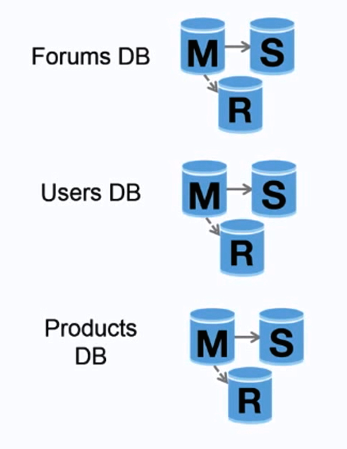

# Database

출처 - https://github.com/donnemartin/system-design-primer#database

<!--more-->

## 관계형 데이터베이스 관리 시스템 (RDBMS)

SQL과 같은 관계형 데이터베이스는 테이블로 구성된 데이터 항목의 모음이다.

ACID는 관계형 데이터 베이스 트랜잭션의 속성 집합니다.

A(Atomicity) - Each transaction is all or nothing

C(Consistency) - Any transaction will bring the database from one valid state to another

I(Isolation) - Executing transactions concurrently has the same results as if the transactions were executed serially

D(Durability) - Once a transaction has been committed, it will remain so

관계형 데이터베이스를 확장하는 기술은 마스터-슬레이브 복제, 마스터-마스터 복제, federation, sharding, denormalization, SQL tuning등의 많은 기술이 있다.

### Master-slave replication

마스터는 읽기 및 쓰기를 제공하고 읽기만 제공하는 하나이상의 슬레이브에 마스터에 쓰기를 한 데이터를 복제한다. 슬레이브 또한 트리구조로 다른 슬레이브에 복제할 수 있다. 마스터가 오프라인이 되더라도 시스템은 슬레이브가 마스터로 변경되거나, 새로운 마스터 서버가 프로비저닝 될 때 까지 읽기 전용으로 계속 작동 할 수 있다.

출처 - https://github.com/donnemartin/system-design-primer#database

#### master-slave 구조의 단점

마스터의 서버가 오프라인 되었을 때 슬레이브가 마스터로 변경되는 로직이 추가적으로 필요하다.

또한 밑의 replication의 단점도 포함한다.

### Master-master replication

두 마스터 서버 모두 읽기 및 쓰기를 제공하고 쓰기에서 서로 조정한다. 두 마스터 서버중 한 서버가 다운되더라도 읽기 쓰기 모두 계속 작동 할 수 있다.

출처 - https://github.com/donnemartin/system-design-primer#database

#### master-master 구조의 단점

* 두개의 마스터 서버가 존재하므로(두 서버가 쓰기 가능) 앞에 로드밸런서가 필요하거나 쓰기 작업을 분산하는 어플리케이션 로직을 추가해야한다.

* 대부분 master-master 구조는 (ACID 위반) 동기화로 인해 쓰기 지연 시간이 늘어난다.

* 더 많은 쓰기 노드가 추가되고 latency가 증가함에 따라 더 많은 충돌 해결이 필요할 수 있다.

* 밑의 replication의 단점도 포함한다.

#### replication 단점

* 새로 쓰여진 데이터를 다른 노드에 복제하기 전에 마스터가 오류가 발생하거나 오프라인이 되면 데이터가 손실 될 수 있다.

* 쓰기는 읽기 전용 replica 서버에 복제되는데 쓰기가 많은 경우 읽기 전용 replica에 복제되는 데이터가 많아서 읽기 자체가 지연될 수 있다.

* 읽기 슬레이브가 많을수록 더 많이 복제해야하므로 복제 지연이 더 커진다.

* 일부 시스템에서 마스터에 쓰기는 병렬로 처리하기 위해 여러 쓰레드를 생성할 수 있지만 읽기 전용 replica 서버는 단일 쓰레드를 사용한 순차적 쓰기만 지원한다.

* replication은 하드웨어에 복잡성을 증가 시킨다.

### Federation

출처 - https://github.com/donnemartin/system-design-primer#database

federation은 기능별로 데이터베이스를 분할한다.

예를들어 모노리틱 데이터베이스 대신에 forums, users, products 라는 3개의 데이터베이스를 가져서 데이터베이스에 대한 읽기 및 쓰기 트래픽을 줄이게 되고 이는 복제 지연이 줄어 들게 된다.

데이터베이스가 작을 수록 메모리에 들어갈 수 있는 더 많은 데이터가 생성되고 결과적으로 향상된 캐시 locality로 인해 더 많은 캐시 적중이 발생한다.

또한 서비스별로 나누게 되면 병렬로 쓰기가 가능해져 처리량이 증가한다.

#### federation의 단점

* 스키마에 거대한 함수나 테이블이 필요한경우 효과적이지 않다.

* 서비스별로 나눠져 있기 때문에 어플리케이션 로직을 추가하여 읽고 쓸 데이터베이스를 결정해야한다.

* 두 데이터베이스의 데이터를 결합하는 것은 복잡하다.

* federation은 더 많은 하드웨어가 필요하고 복잡성이 증가된댜.

### Sharding

출처 - https://github.com/donnemartin/system-design-primer#database

sharding은 각 데이터베이스가 데이터의 하위 집합만 관리 할 수 있도록 서로 다른 데이터베이스에 데이터를 분산한다.

사용자 데이터베이스를 예로 들면 사용자 수가 증가하면 더 많은 샤드가 클러스터에 추가된다.

federation의 이점과 마찬가지로 sharding은 읽기 및 쓰기 트래픽을 줄이고 복제를 줄이고 캐시 적중을 증가시킨다.

인덱스 크기도 줄어들어 일반적으로 빠른 쿼리를 사용할 수 있고 이는 성능이 향상된다.

하나의 샤드가 다운되더라도 다른 샤드는 여전히 작동하지만 데이터 손실을 방지하기 위해 어떤 형태의 replication을 추가하는게 좋다.

federation과 마찬가지로 쓰기를 직렬화하는 단일 중앙 마스터가 없으므로 처리량을 늘리면서 병렬적으로 쓸 수 있다.

사용자 테이블을 분할하는 일반적인 방법은 사용자의 last name initial을 사용하거나 사용자의 geographic location을 사용하는 것이다.

#### sharding의 단점

* 샤드 작업을 위한 어플리케이션에 로직을 추가해야하므로 복잡한 쿼리가 발생할 수 있다.

* 데이터 분산은 한 샤드에 치우칠 수 있다. 예를들어 파워 유저 집합은 다른 샤드에 비해 해당 샤드에 대한 부하를 증가시킬 수 있다.

    * rebalancing은 추가적인 복잡성을 만든다. 일관된 해싱을 기반으로하는 샤딩 기능은 전송되는 데이터의 양을 줄일 수 있다.

* 여러 샤드의 데이터 결합은 복잡하다.

* 샤딩은 하드웨어와 복잡성을 증가시킨다.

### Denormalization

비정규화는 일부 쓰기 성능을 희생하면서 읽기 성능을 향상 시키려고한다.

데이터의 중복 복사본은 expensive join을 피하기 위해 여러 테이블에 기록된다.

PostgresSQL 및 Ocacle과 같은 일부 RDBMS는 중복 정보를 저장하고 중복 복사본의 일관성을 유지하는 작업을 처리하는 구체화된 뷰를 지원한다.

federation 및 sharding과 같은 기술로 데이터가 분산되면 데이터 센터에서 조인을 관리할 때 복잡성이 더욱 증가한다.
  비정규화는 이러한 복잡한 조인의 필요성을 피할 수 있다.

대부분 시스템에서 읽기대 쓰기 비율을 100 : 1 또는 1000 : 1보다 훨씬 많을 수 있다.

복잡한 데이터베이스 조인을 초래하는 읽기는 비용이 많이 들고 디스크 작업에 상당한 시간이 소요 될 수 있다.

#### Denormalization의 단점

* 데이터가 중복된다.

* 복사본이 동기화 상태를 유지해야하므로 데이터베이스 설계가 복잡해진다.

* 쓰기 로드가 많은 비정규화된 데이터베이스는 정규화된 데이터베이스보다 성능이 떨어질 수 있따.

### SQL tuning

sql튜닝은 광범위한 주제이다.

병목현상을 시뮬레이션하고 발견하기 위해 벤치마킹하고 프로파일링 하는 것이 중요하다.

* 벤치마크 - ab와 같은 도구를 사용하여 고부하 상황을 시뮬레이션한다.

* 프로파일링 - 성능 문제를 추척하는데 도움이 되는 느린 쿼리 로그와 같은 도구를 활성화 한다.

벤치마킹 및 프로파일링은 다음과같은 최적화를 할 수 있다.

* MySQL dumps to disk in contiguous blocks for fast access.
* Use CHAR instead of VARCHAR for fixed-length fields.
    * CHAR effectively allows for fast, random access, whereas with VARCHAR, you must find the end of a string before moving onto the next one.
* Use TEXT for large blocks of text such as blog posts. TEXT also allows for boolean searches. Using a TEXT field results in storing a pointer on disk that is used to locate the text block.
* Use INT for larger numbers up to 2^32 or 4 billion.
* Use DECIMAL for currency to avoid floating point representation errors.
* Avoid storing large BLOBS, store the location of where to get the object instead.
* VARCHAR(255) is the largest number of characters that can be counted in an 8 bit number, often maximizing the use of a byte in some RDBMS.
* Set the NOT NULL constraint where applicable to improve search performance.

좋은 인덱스 쓰기

* 쿼리시 (SELECT, GROUP BY,ORDER BY, JOIN)은 더 빠를 수 있다.

* 인덱스는 일반적으로 데이터를 정렬하고 시간에 따른 검색, 순차 액세스, 삽입 및 삭제를 허용하는 self-balancing b-tree로 표시된다.

* 인덱스를 배치하면 데이터를 메모리에 보관할 수 있으므로 더 많은 공간이 필요하다.

* 인덱스도 업데이트해야하므로 쓰기 속도도 느려질 수 있다.

* 많은 양의 데이터를 로드하는 경우 인덱스를 비활성화 하고 데이터를 로드한다음 인덱스를 다시 작성하는 것이 더 빠를 수 있다.

