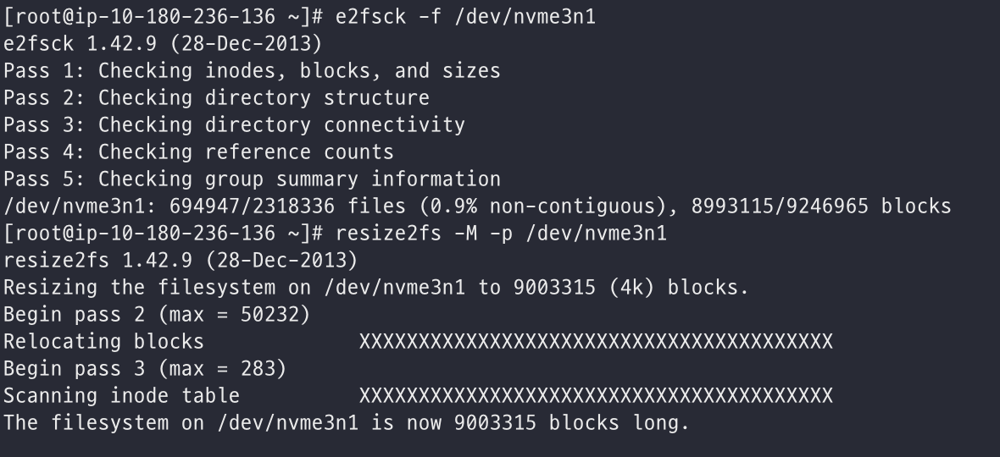
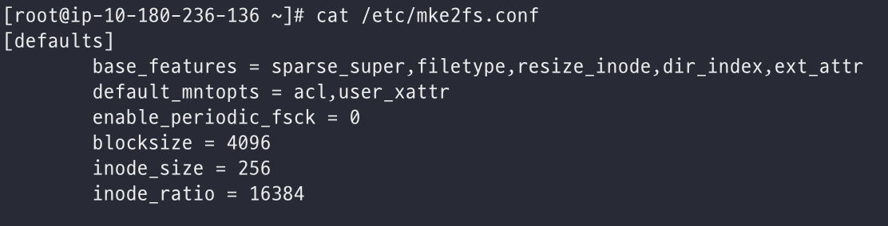
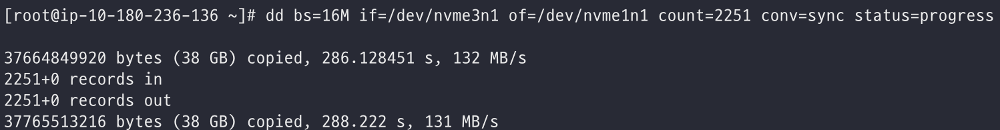
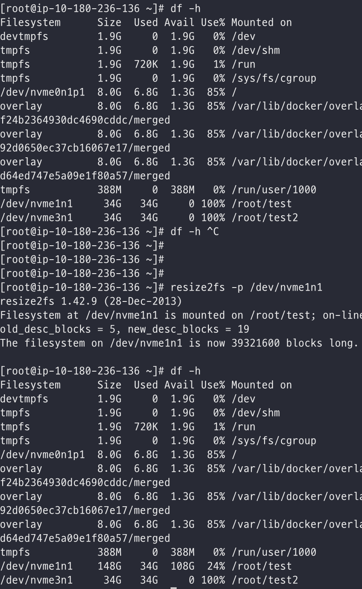

# AWS volume 복제를 위해 dd 명령어를 사용해보자

AWS volmue을 복제하여 mount 하는 작업이 필요한 상황에서 dd 명령어를 통해 파일을 복제 해보자.

<!--more-->

Jenkins를 이용하는 도중 web 페이지가 너무 느려서 확인해보니 jenkins는 파일기반으로 job들을 관리하고 있었다.
또한 Web에서 job을 불러오거나 설정을 불러올 때 xml 파일을 읽어 뿌려주는 형태로 동작하는 것 같다.

따라서 너무 느려서 확인해보니 HDD로 mount하여 운영중이였고 이를 SSD로 이전하는 작업을 진행하였는데, HDD의 volume size는 500G였고 aws volume 특성상 그 크기보다 작은 size로 데이터를 쉽게 이관하는 것은 불가능 했다. 따라서 150G정도의 SSD volume를 생성하고 데이터 이관하는 작업에 대한 내용을 기록해보자.

가장 쉽게 하는 방법은 두개의 volume을 mount 시켜놓고 파일을 cp명령으로 복사 하는 것이였다.

같은 volume의 경우 mv 명령어가 inode 주소는 같게 옮겨 지기 떄문에 속도가 더 빠르겠지만 현재는 다른 volume이니까 mv 명령어를 사용해도 inode 주소도 새로 생서되어 복사 되므로 속도면에서 이점이 없다. 심지어 cp 명령어보다 기존 파일을 지워야하기 때문에 속도면에서는 느릴 수 있을 것 같다.

그다음 생각해볼건 rsync 명령어였고 이것도 결국 내부적으로 mv와 같은 방식으로 동작하는 것으로 어디서 본것 같다.

찾아보다가 dd 명령어를 확인했고, 이는 블록 단위로 파일을 복사하거나 이동할 수 있는 명령어라고 한다.
속도면에서는 가장 좋을 것 같아 바로 테스트를 진행했다.

volmume 사이에 데이터 복제를 하는 것이기 때문에 1개의 volmue은 jenkins에서 사용하는 volume을 스냅샷 떠두고, 다른 하나의 volmue은 SSD로 생성하였다.
이 두개의 volmue을 하나의 작은 인스턴스에 attach 시켜둔다.

dd 명령어는 block 단위로 파일을 복사하는 것이기 때문에 기존 volume에 block size를 다음과 같이 확인한다.

먼저 `e2fsck -f /dev/nvme3n1` 명령어로 check 해주고 `resize2fs -M -p /dev/nvme3n1` 명령으로 block size를 확인한다. 이때 -M 옵션은 파일시스템의 크기를 최소로 줄여준다.

이로 인해 /dev/nvme3n1 volume의 사용중인 block size는 9063464로 확인되었다.

amazon linux2는 default blocksize가 4096로 설정되어있어 있는 것도 확인 할 수 있다.

blockcount * 4 / (16 * 1024)

dd 명령어 사용시 한번에 읽고 쓸 byte 크기를 지정할 수 있는데 (bs 옵션) 여기서 지정할 byte값도 구해야한다. 물론 bs 옵션을 주지않고 돌려도 되지만 효율적이지 않을 것이라 생각되서..

여기서는 16M 으로 설정하고 옵션을 주면 또 다른 옵션인 count 옵션이 있는데 이는 지정된 block 수 만큼 복사 할 수 있다.
따라서 이 count 값을 구해서 dd 명령어 날릴때 같이 넣어 줘야한다.

아까 위에서 block size는 9003315 확인했고, default block size는 4K 이므로 9003315 * 4 Kbyte 가 될 것이고.

16M씩 읽고 쓰기로 했으니 K로 변환하면 16 * 1000.

결과적으로 (9003315 * 4) / (16 * 1000) = 2251로 block 수를 지정하면 될 것 이라 생각했다.

그대로 복사를 시작하고 확인하니 38G가 복사된 것을 볼 수 있다. 이제 mount 해서 데이터를 확인해보자.

dd 명령 직후 df -h로 확인해보면 Size가 34G로 설정되어 있는데 이를 다시 `resize2fs -p /dev/nvme1n1`하면 150G에 34G로 정상적으로 보이는 것을 확인할 수 있다.

---

**참고**

* https://matt.berther.io/2015/02/03/how-to-resize-aws-ec2-ebs-volumes/
