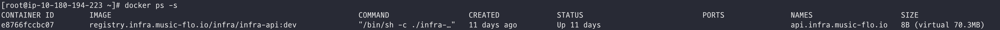

# docker file system

docker에서 사용하고 있는 Union File System`(UFS)`에 대해 이해해보자.

UFS는 쉽게 여러 개의 File System을 하나로 결합하여 취급할 수 있도록 해주는 FS라 보면 된다.

<!--more-->

## UFS

docker image를 이용해 container를 띄운다는 것은 밑의 그림과 같이 image layer(read-only layer)위에 container layer(writable layer)를 얹은 후 사용자에게 root filesystem으로 제공하는 것이다. 

container를 띄울 때 사용하는 image들은 변경되지 않고 유지되는 이유가 이에 있다. container를 띄우고 변경하는 사항(Diff)들은 하단의 image layer(read-only)를 사용하지 않고 container layer(writable layer)를 이용하기 떄문에..

다만 container를 내리게 되면 내부에 생성된 파일이라던지 변경된 작업들이 사라지게 된다. 이 변경 사항들(Diff)를 유지하고자 한다면 

* container에서 `docker commit`으로 새로운 image를 생성하거나
* volume을 구성하여 변경사항은 해당 volume에 저장하도록 하거나

보통은 image를 변경하지 않기 때문에 volume을 많이 이용한다.

### Container size

간단하게 위에서 말한 image layer와 container layer의 size를 확인해보자.

현재 sample로 가져온 docker image 크기는 70.3MB이다.

이 image로 띄운 container도 동일하게 70.3MB로 표시되지만 8B정도 container내에서 사용한 것을 볼 수 있다.

* virtual size : read-only + writable 
* size : writable size

여기서 만약 container내부에 파일을 생성해보면 49B정도 추가된 것을 볼 수 있다.

이제 이걸 docker commit으로 새로운 image를 만들어보자.

docker history를 조회해보면 맨 상단의 layer가 위에서 추가한 file이 적용 된 것을 볼 수 있다.

지금 이렇게 변경한 사항들은 모두 호스트의 /var/lib/docker 디렉토리에 저장된다. 이 영역을 backing filesystem이라고 한다.

### Storage Driver

container에서 사용자가 UFS를 통해 filesystem을 쉽게 사용할 수 있는 것은 storage driver가 있기 떄문이다. 
storage driver는 file i/o 처리를 하는 녀석이다.

보통 많이 사용하는 storage driver는 overlay를 많이 사용하고 이는 os에 따라 다를 수 있다.

container layer(writable layer)는 backing filesystem의 특정 영역에 mount가 되어 있어야하고 아까 본 container의 mount된 것을 확인해보면 밑의 사진과 같이 확인 할 수 있다. 

host의 /var/lib/docker/overlay2/ 해당 폴더를 확인하면 아까 생성한 test.txt가 존재하는 것을 확인할 수 있다.

