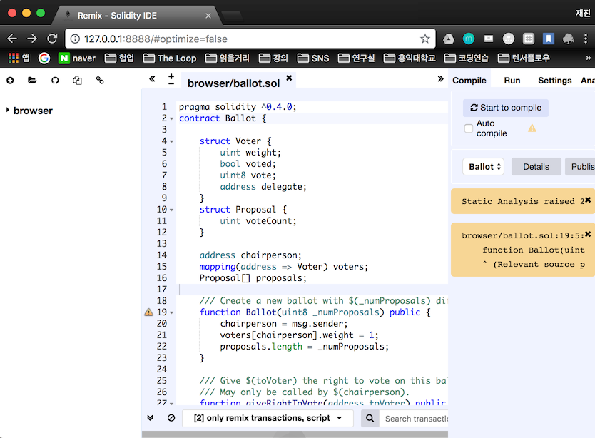
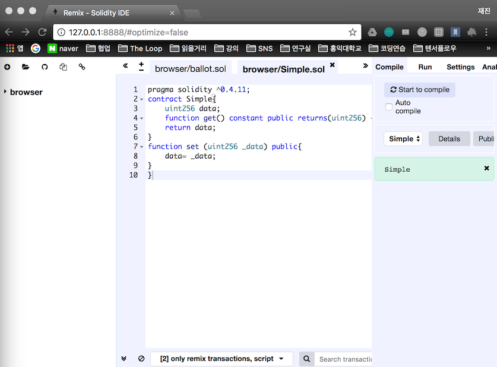
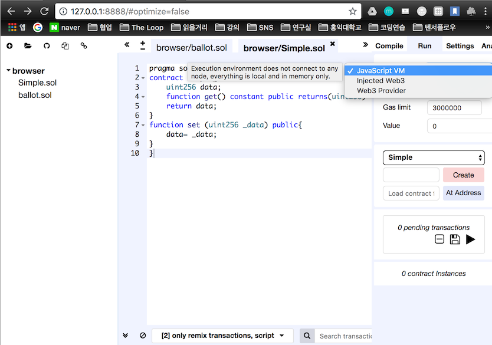
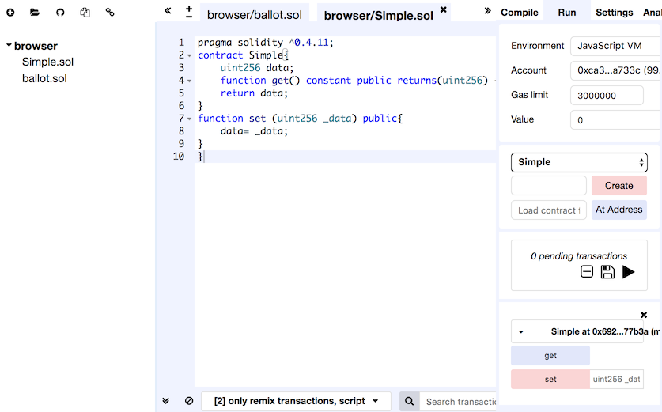
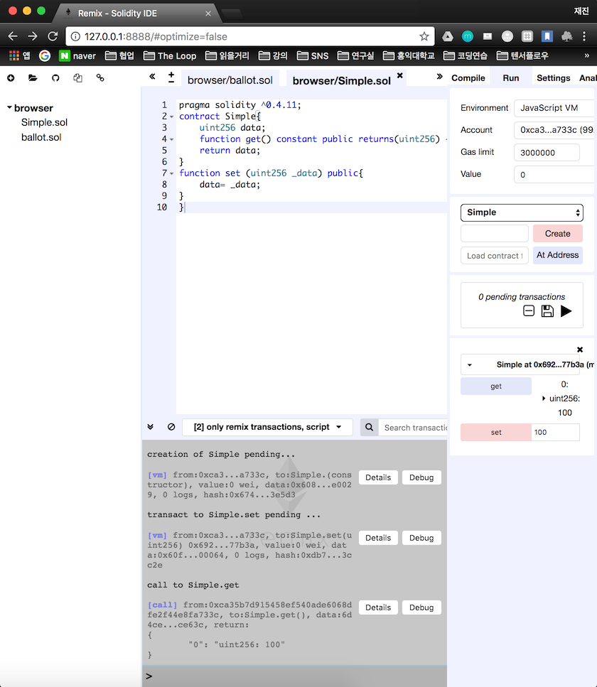
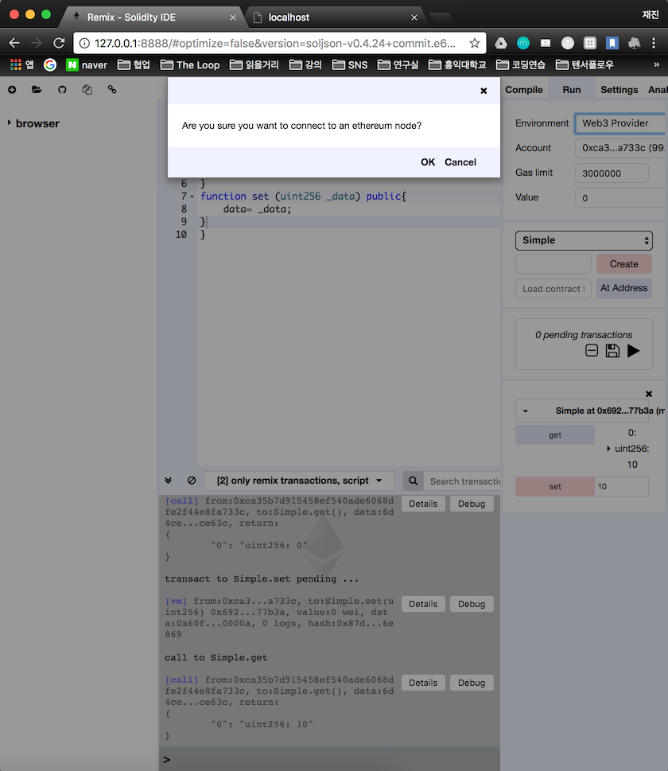
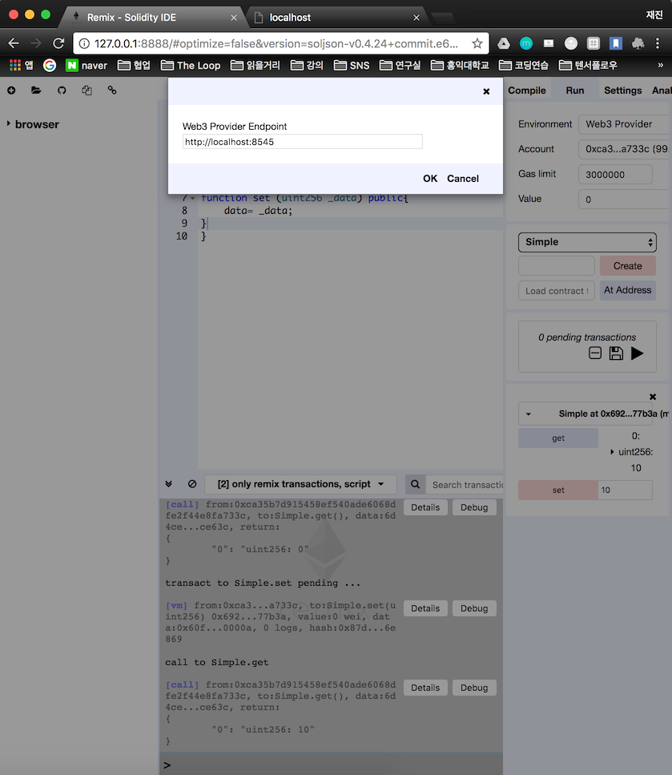
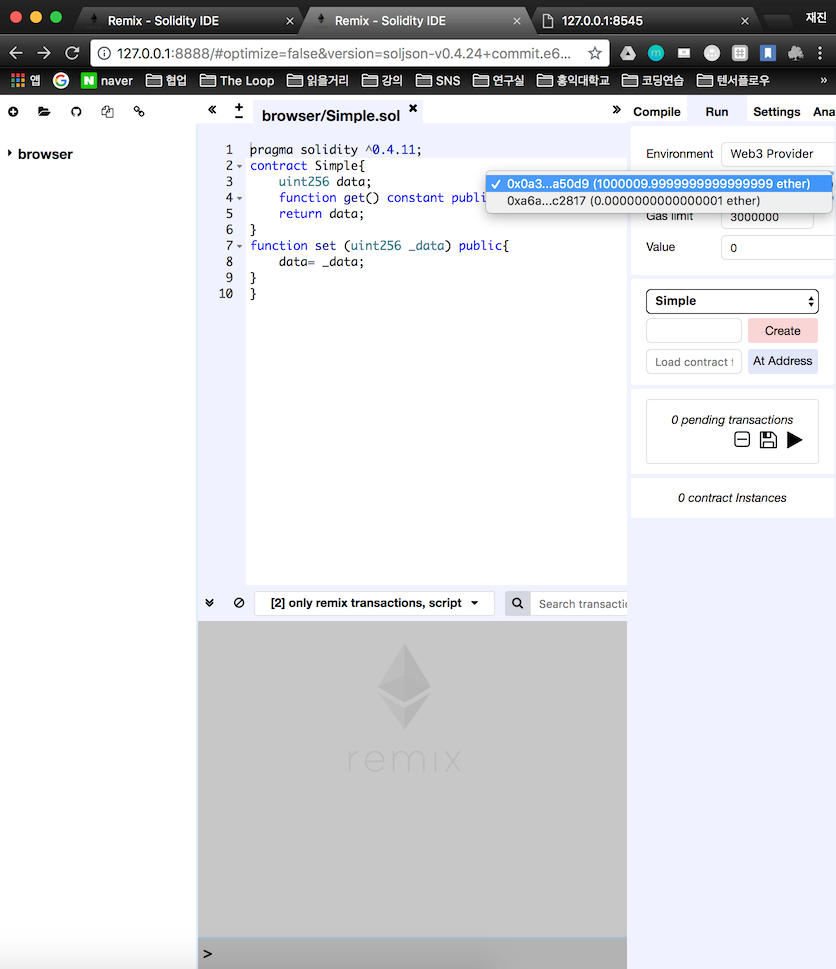
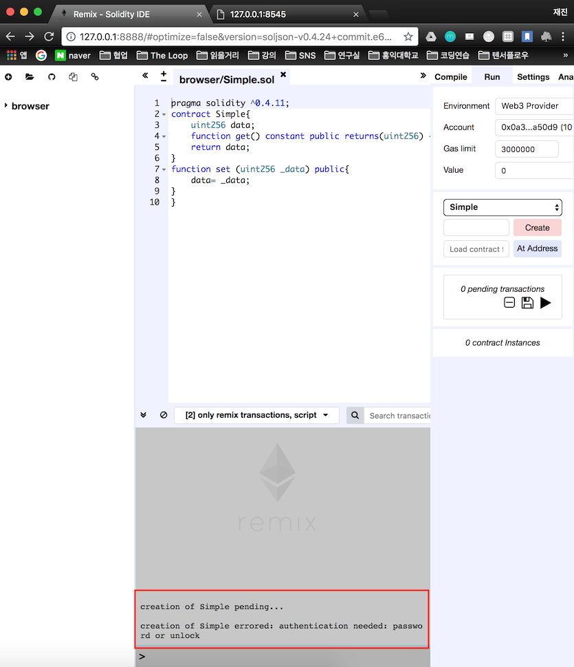
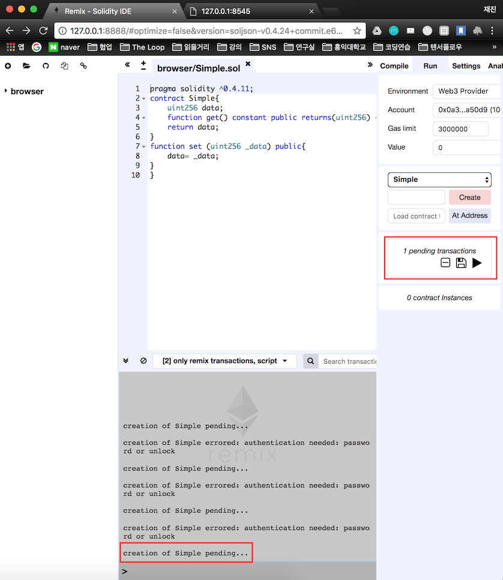

# Preparing for deploy smart contract

이전에 geth로 생성한 private net를 rpc 옵션을 사용해서 클라이언트 앱 연동 (ethereum wallet)을 해보자.

<!--more-->

연동할 앱은 remix이다. remix는 이더리움 스마트 컨트랙트를 만들 때 사용하는 언어인 solidity ide 툴이다.

[ethereum/remix-ide](https://github.com/ethereum/remix-ide/tree/gh-pages)

다운을 받아서 압축을 푼뒤 index.html 을 실행하면 된다.

나는 도커로 했기 때문에 컨테이너의 80번 포트를 뚫어주고 접속하였다.

컨테이너 80 번하고 host의 8888번 포트를 연결해서 접속한 결과이당

## 스마트 컨트랙트 작성하기

새로운 simple.sol 파일을 만들어서 

~~~solidity
pragma solidity ^0.4.11;
contract Simple{
    uint256 data;
    function get() constant public returns(uint256) {
        return data;
    }
    function set (uint256 _data) public{
        data= _data;
    }
}
~~~

다음과 같이 작성했다. 

작성후 오른쪽에 start to compil 을 누르면 밑에 녹색 바탕의 simple처럼 스마트 컨트랙트의 이름이 표시된다.

### Remix을 이용한 스마트 컨트랙트 배포

remix에서는 세 종류의 배포 방법을 제공한다. run 패널로 이동해서 environment를 클릭해보면 `javascript vm` , `injected Web3` , `Web3 provider` 가 있다.

- javascript vm을 선택하면 이더리움 노드 없이 가상으로 스마트 컨트랙트를 배포하고 실행해 볼 수 있다. 실제로 배포 하기 전 테스트용으로 사용하기 좋다.
- injected Web3는 metamask와 같은 브라우저 플러그인과 연동할 때 사용한다. 다른 클라이언트 앱과 연동할 때 사용하는 걸로 생각하면 된다.
- web3 providersms  private network와 연동할 대 사용하는 옵션이다.

우선 javascript vm환경에서 제대로 실행되는지 확인해보자.

javascript vm을 선택하고 create를 누르면 밑에  get, set함수가 나타난다. 

먼저 set옆에 100을 누른다음에 

get을 누르면 100이 나오는 걸 확인할 수 있다.

### private network와 연결하고 스마트컨트랙트 배포하고 사용하기

remix를 private network와 연동하기 위해서는 network를 실행 할 때 geth에 rpc 옵션을 설정해줘야 한다. ( Ethereum wallet과는 ipc를 통해 연결 한다.)

- --rpc 는 http-rpc 서버를 사용하게 하는 옵션이다.
- --rpcaddr은 rpc로 사용하는 주소를 명시하는 옵션이고 기본은 localhost이다.
- --rpcport는 rpc로 사용하는 포트를 지정하는 옵션이다. 기본은 8545이다.
- --rpcapi는 rpc로 접속한 앱에서 사용할 수 있는 api 종류를 지정하는 옵션이다.
- --rpccorsdomain은 network에 접속할 도메인을 지정할 수 있는 옵션이다.

rpcaadr, rpcport는 기본으로 하고 rpcapi 는 'db, eth, net, web3' 을 rpccorsdomain은 "*"을 지정한다. *는 모든 도메인에서 접근하게 하는것이다. 실제로 서비스 할 떄는 *를 사용하지 않는게 좋다.

geth를 실행한다.

~~~bash

$ geth --datadir "./data" --identity "mynetwork" --networkid 1988 --rpc --rpcport 8545 --rpcapi "db,net,web3,eth" --rpccorsdomain "*" --rpcaddr "0.0.0.0" console

$ geth --datadir "./data" --identity "mynetwork" --networkid 1988 --rpc --rpcport 8545 --rpcapi "db,net,web3,eth" --rpccorsdomain "*" --rpcaddr "0.0.0.0" console
~~~

나는 docker 로 했기 때문에 rpcaddr 0.0.0.0을 추가해줬다.

이후 remix로 돌아와 remix의 environment를 web3 provider로 변경한다. 그러면

다음과 같이 경고가 뜨고 ok를 누른다.

주소를 확인하고 ok

연결에 성공했다!!

하지만 에러가 발생하는데 

스마트 컨트랙트를 배포할 때는 gas를 사용하게 된다. 그래서 컨트랙트를 배포하는 계좌에서  gas를 소비할 수 있게 락을 풀어줘야한다. geth 콘솔창으로 이동후에 
~~~bash

> personal.unlockAccount(eth.accounts[0])
Unlock account 0x0a39454d85c9ff43f5aba2025da36d67ccfa50d9
Passphrase:
true
~~~

락을 풀어주고 다시 Remix로 이동해서 create를 클릭한다.

javascript vm 환경에서 했던 것과 다르게 바로 컨트랙트가 배포되지 않고 pending단계로 빠지는 것을 볼 수 있다. 채굴을 해줘야 마무리가 되기 때문에 geth에 가서 miner.start()를 해준다.

~~~bash
> INFO [08-18|08:26:59.024] Submitted contract creation              fullhash=0x7e4c9193d46ec3cfda05dc021d339351fc3a7259ec83fc74e99e602ec5f069e7 contract=0x78dAD2e8384B6ce2052f0626eCb51b6b0A5d77b4
~~~
