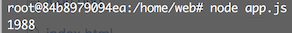
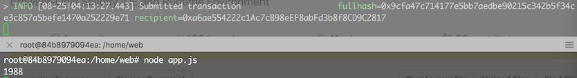

# Connecting to ethereum network using web3

node.js의 web3를 이용해서 ethereum network를 web에서 접속해보자.

<!--more-->

### eth 컨테이너

일단 eth node 에 geth를 실행시켜놔야한다.

~~~bash
geth --datadir "./data" --identity "mynetwork" --networkid 1988 --rpc --rpcport 8545 --rpcapi "db,net,web3,eth,personal" --rpccorsdomain "*" --rpcaddr "0.0.0.0" --rpcvhosts=* --nodiscover console
~~~

그럼 web3 8545 포트로 rpc접속 가능하다.

### node.js 컨테이너

docker node.js 컨테이너를 만들고

~~~bash
$ npm install web3 --save
$ npm install ethereum/web3.js --save
~~~

두개의 npm모듈 설치하고

~~~bash
var Web3 = require("web3");
web3 = new Web3(new Web3.providers.HttpProvider("http://relaxed_lamport:8545"));
var network_version = web3.version.network;
console.log(network_version);
~~~

이 코드를 app.js에 넣고 실행하면

network_version ( 1988 )이 잘 출력된다. 

내가 1988이라 설정해줬으므로 eth geth에서 ..

### 이더 전송하기

~~~bash
var accounts = web3.eth.accounts;  //account 정보 가져오기
var from_account = accounts[0];
var to_account = accounts[1];

var transactionObj = { //transaction object 설정
    from: from_account,
    to:to_account,
    value: 1000
};

web3.eth.sendTransaction(transactionObj)
~~~

app.js 에 이 부분을 추가 해준다. 

그전에 geth에서 **personal.unlockAccount(eth.accounts[0])**를 실행시켜줘야한다.

이것도 web에서 변경할 수 있는 것을 찾아야 할 것이다.

위가 geth , 밑에가 node.js 이다. 잘 전송되는것을 확인했다.

하지만 아직 전송이 되지않았다. 왜냐하면 블럭을 생성 안했기 떄문에..

geth에서 miner.start()를 실행해준다.

### web3에서 스마트컨트랙트 사용하기

먼저 이전에 스마트컨트랙트 배포가 이루어진 후에 이루어져야한다.

스마트 컨트랙트의 address를 알아야하기 때문에..

app.js에 다음 코드를 추가한다.

~~~bash
var contractAbi = [{"constant":false, "inputs":[{"name":"_data", "type":"uint256"}],"name":"set","outputs":[],"payable":false,"stateMutability":"nonpayable","type":"function"},{"constant":true,"inputs":[],"name":"get","outputs":[{"name":"","type":"uint256"}],"payable":false,"stateMutability":"view","type":"function"}];

var contractAddress = "0xab2274abf1e4712bba53ffba1c53ba1e54fbeb4d";
var contract = web3.eth.contract(contractAbi);
var contractInstance = contract.at(contractAddress);

var result = contractInstance.get();
console.log(result.toString());

var contractAddress는 스마트 컨트랙트의 주소이다.

root@84b8979094ea:/home/web# node app.js
1988
1000
~~~

1000이 잘 출력된다.
