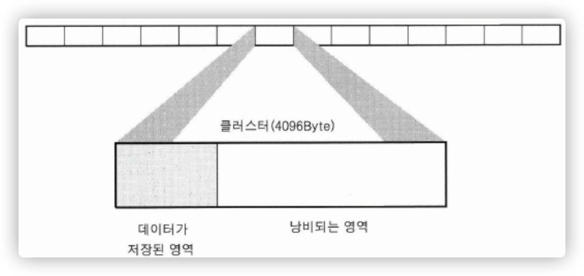

# FileSystem

FS는 `저장장치 내에서 데이터를 읽고 쓰기 위해 미리 정해진 약속` 이라고 볼 수 있다. 

<!--more-->

또한 컴퓨터에서 파일이나 자료를 쉽게 발견 및 접근할 수 있도록 보관 또는 조직하는 체제를 가리킨다.

## 소개

파일 시스템은 일반적으로 크기가 일정한 블록들의 배열에 접근할 수 있는 자료 보관 장치 위에 생성되어 이러한 배열들을 조직함으로 파일이나 디렉터리를 만들며 어느 부분이 파일이고 어느 부분이 공백인지 구분하기 위하여 각 배열에 표시를 해둔다.

자료를 클러스터 또는 블록 이라고 불리는 일정한 단위에 새겨 넣는데 이것이 바로 파일 하나가 필요로 하는 디스크의 최소 공간이다.

## 분류

1. 일반적인 파일 시스템

    일반적인 FS는 하드디스크와 같은 저장장치에서 주로 사용된다. 그 종류를 간단히 보면 다음과 같다.

    - FAT (File Allocation Table)

        FAT은 어느 영역에 파일이 속해 있는지, 공간에 여유가 있는지, 또 어디에 각 파일이 디스크에 저장되어 있는지에 대한 정보를 중심으로 하는 테이블을 이용하는 것에서 비롯한다.

        상대적으로 간단한 파일 시스템. 성능은 상대적으로 다른 파일 시스템보다 좋지 않다. 너무나도 단순한 자료구조를 사용하고 조그만 파일이 많으면 공간 활용률이 적어지기 때문이다.

        FAT12, FAT16, FAT32, exFAT등 종류가 더 있다.

    - HPFS (High Performance FileSystem)
    - NTFS (New Technology FileSystem)
        - FAT32의 약점을 보완하기 위해 개발된 FS
        - 드라이브 최대용량 256TB
        - 파일 하나당 저장할 수 있는 최대 크기 16TB
        - 윈도우에서는 최적화 되어 있지만, MAC, android, linux와 같은 기기는 제한되어있음.
    - UFS (Unix FileSystem)
    - ext
        - ext, ext2, ext3, ext4의 종류들이 있다.
        - `리눅스용 파일 시스템 가운데 하나` 로 오늘날 많은 리눅스 배포판에서 주 파일 시스템으로 쓰이고 있다.
    - APFS
        - 애플 파일 시스템은 애플에서 macOS, iOS, watchOS, tvOS등에서 범용으로 사용하고자 만든 FS
2. Flash FileSystem
3. Network FileSystem

    네트워크 파일시스템은 원격에 위치한 파일시스템을 로컬 파일시스템처럼 이용할 수 있도록 개발한 프로토콜이다.

    단순히 파일 공유가 아니라 NFS도 파일 시스템임을 인지 해야 하기 때문에 원격 파일시스템이 mount되면 mount 지점 아래 위치한 파일에 접근을 하는 경우 NFS가 파일시스템 레벨에서 system call을 받아 직접 네트워크 파일을 수신해 쓰거나 실행할 수 있도록 한다.

4. Virtual FileSystem

    OS차원에서 가상 파일시스템이라는 상위 레벨의 파일시스템 인터페이스가 존재하기 때문에 응용프로그램에서는 아무 구분 없이 OS의 system call을 호출하면 커널은 미리 등록 되어 있는 파일시스템 함수를 호출해 같은 경과를 얻을 수 있다.

## 요소

### 클러스터

클러스터는 파일을 저장하는 단위로 1개 또는 복수의 섹터로 이루어진다. 여러 개의 클러스터를 사용할 때 반드시 연결되어 있지 않다. 여기저기 흩어져 있어도, 그 위치와 순서를 기록한 FAT등에 의하여 관리되므로 한 번에 파일의 전체 내용을 읽을 수 있다.

- OS가 파일시스템 생성 시 저장장치의 크기를 고려해 클러스터의 크기를 조절한다.
- 저장장치의 크기 및 사용 용도에 따라 달라져야한다.
- OS에 의해 데이터를 읽고 쓰는 과정에서 파일시스템은 미리 정해져 있는 클러스터의 크기를 기본단위로 하여 읽고 쓰는 과정에서 파일시스템은 미리 정해져있는 클러스터의 크기를 기본단위로 하여 입출력을 하게 된다.
- 클러스터의 크기가 4096Byte라면 1Byte를 읽더라도 4096Byte를 읽어야한다.

    

    크기가 작은 파일을 저장할 경우 낭비되는 영역이 생기는데 이 부분의 공간은 사용이 불가능 해진다.

    낭비되어도 성능적인 측면에서 I/O의 비용이 커서 요즘의 대용량 하드라면 성능을 위해 무시할 정도다

### 파일

파일시스템은 결국 파일을 기록하기 위한 것이므로 파일을 이루는 구조와 관리할 수 있는 추가적인 방법을 제시한다.

파일은 속성을 기록하는 메타 데이터, 실제 데이터를 기록하는 데이터 영역으로 나뉜다.

**파일 정보 요청 프로세스**

1. 파일정보요청 → Meta Data 로 파일 경로 요청을 보낸다.
2. Meta Data → 요청 파일 경로 안내를 해준다.
3. Meta Data로 부터 받은 경로로 실제 파일로 접근한다.

---

**참고**

* https://blog.naver.com/bitnang/70183421214
