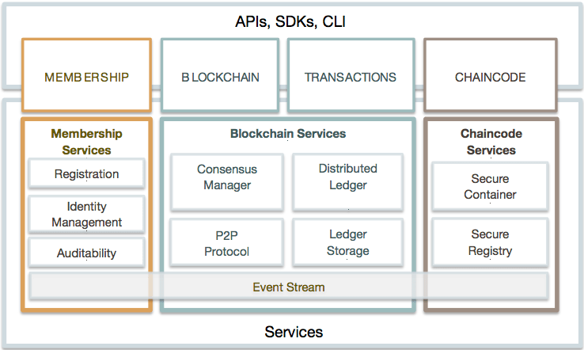
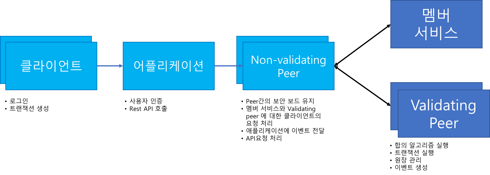

# Hyperledger Fabric

Hyperledger Fabric에 대해 알아봅시다.

<!--more-->

## Hyperledger 하위 프로젝트

Hyperledger에는 여러 하위 프로젝트가 있다.

### Blockchain Explorer

Blockchain Explorer는 Blockchain 런티암에 대한 다양한 정보를 보여주기 위한 웹 기반 어플리케이션을 만드는 프로젝트이다. 

ICON에서 [Tracker](https://tracker.icon.foundation/) 처럼 Block, Tx 정보를 보여주거나, Chaincode 및 원장의 정보들을 모니터링 하기 위한 기능을 포함하고 있다.

### Fabric

Fabric은 Blockchain 기술을 구현한 프로젝트이다. 즉 엔진을 만드는 프로젝트. Chaincode라고 부르는 SmartContract 코드를 통해 적용 시킬 수 있다.

### Iroha

Iraha는 시스템에 분산원장의 기능을 쉽게 통합하고자 하기 위한 목적으로 개발 되고 있는 프로젝트

### Sawtooth Lake

## Hyperledger Fabric

### 용어

* Transactor : transaction을 일으키는 Entity
* Transaction : Tx
* Ledger : Tx와 현재 상태를 포함하는 일련의 암호 학적으로 링크 된 Block. 이전 거래의 데이터 외에 원장에는 현재 실행중인 ChainCode의 데이터가 포함되어 있다.
* World state : Tx에 의해서 Chaincode가 호출될 때 상태 및 데이터 저장을 위한 Key-value 데이터베이스
* Chaincode : 다양한 Tx유형을 구현한 Blockchain에 임베드 되는 로직. SmartContract라고 보면 될거 같다. Chaincode는 Tx 를 일으키고 유효성이 확인되면 공유원장에 추가하고 World state를 수정한다. 
* Validating peer(VP) : Blockchain network에서 원장을 관리 유지하기 위해 Tx의 유효성을 검증하는 합의 프로토콜을 실행하는 노드이다. 합의에 실패하면 Block에서 제거되므로 장부에 기록되지 않는다. Validating peer는 Chaincode를 deploy, invoke, query할 권한을 가진다.
* Non-validating peer(NVP) : Transactor가 Validating peer에 접속 할 수 있도록 프록시 역할을 하는 노드. NVP는 호출된 요청을 Validating peer로 전달하며, 이벤트 스트림, REST를 담당하는 노드이다.
* Consensus : Blockchain network의 Tx(deploy, invoke) 순서를 유지하는 프로토콜, Validating 노드들은 합의 프로토콜을 구현하여 Tx를 승인하기 위해 동작한다. 
* Permissioned network : 각 노드는 Blockchain network에서 접근 권한을 관리해아 하는 노드, 각 노드는 권한이 있는 사용자만 접근할 수 있다.

### 아키텍쳐

1. Membership Services

Blockchain network에서 인증 서비스를 제공한다. Non-permissioned blockchain의 경우 사용자 인증이 필요없고, 모든 노드는 동등하게 Tx 처리가 가능하고 Block에 Tx 정보를 입력할 수 있다. Membership Services는 PKI(Public Key Infrastructure)와 분산화/합의 컴포넌트를 non-permissioned Blockchain에서 permissioned Blockchain으로 변환시킨다.  Permissioned Blockchain에서는 Entity가 장기적인 인증서(enrollment certificates)를 획득하기 위해 등록절차를 거치게 되며, Entity 유형에 따라 구별될 수 있다. 사용자의 경우 TCA (Transaction Certifacate authority)가 인증서를 발급 할 수 있다. 여기서 얻은 인증서는 Tx를 발생시킬때 인증에 사용된다.

2. Blockchain Services

Blockchain Services는 HTTP/2를 기반으로 P2P 프로토콜을 통해 분산원장을 관리한다. 데이터 구조는 Hash 알고리즘을 통해 World state를 복제하는 등 관리 하는데 가장 효율적으로 관리 할 수 있도록 최적화되어 있다. 필요에 따라 합의 알고리즘 플러그인(PBET,PoW, PoS..)을 연결하고 구성 할 수 있다.

3. Chaincode Services

Chaincode Services는 Validating node에서 안전하고 가벼운 방법으로 Chaincode가 실행되도록 보장한다. 환경은 보안 OS 및 Chaincode 언어, Go, Java 및 Node.js등 사용할 수 있다.

4. 그외

4.1. Events

Validating peers와 chaincode는 Blockchain network에서 Event를 발생할 수 있다.  
Event 발생을 대기하고 있는 어플리케이션에 필요한 노티를 보낸다. 또한 Web hooks나 Kafka 등을 이용하여 Event 수신도 가능하다.

4.2. Application Programming Interface (API)

Fabric에 대한 기본 Interface REST API이다. API 호출을 통해 사용자 등록, Blockchain에 대한 쿼리, Tx발생 들을 할 수 있다. 특히 Chaincode와 상호작용하기 위한 API를 통해 Tx를 관리 할 수 있다. 

4.3. Command Line Interface (CLI)

REST API의 일부 기능을 지원하는 CLI기능을 통해 Chaincode의 deploy 및 Tx 처리 등을 빠르게 진행할 수 있도록 한다. CLI는 Go로 제작이 되어 있으며 다양한 OS를 지원한다.

### 토폴로지

Fabric을 통한 Blockchain network는 하나의 멤버쉽 서비스와 다수의 Validating peer와 non-validating peer 들로 이루어 질 수 있다. 이 모든 컴포넌트를 통해 하나 또는 다수의 체인을 운영 할 수 있다.

1. Single Validating Peers

기능적으로 non-validating peer는 validating peer의 서브셋이다. 그러므로 모든 non-validating peer의 기능은 validating peer로 사용 가능하다. 그래서 가장 간단한 Blockchain의 network는 하나의 validating peer로 구성된 Blockchain network이다. 

2. Multiple Validating Peers

운영환경이거나 개발 환경일 경우 다양한 validating peer와 non-validating peer를 이용하여 Blockchain network를 구성해야 합니다. 이 구성에서 non-validating peer는 Event 처리 및 REST API 서비스 관리등의 역할을 하게 되는 노드이다. 

Validating peers들은 Blockchain network 상에서 일어나는 모든 Event, Tx등의 데이터를 공유하게 된다.

3. Multichain

Blockchain network는 validating peer와 non-validating peer로 이루어져 있다.  
다양한 목적에 따라서 이와 같은 조합으로 다양한 Blockchain을 구성 할 수 있다.

---

**참고** - [IBM Developer Blog](https://developer.ibm.com/kr/developer-%EA%B8%B0%EC%88%A0-%ED%8F%AC%EB%9F%BC/2017/01/15/blockchain-basic-02-hyperledger-fabric-overview/)
