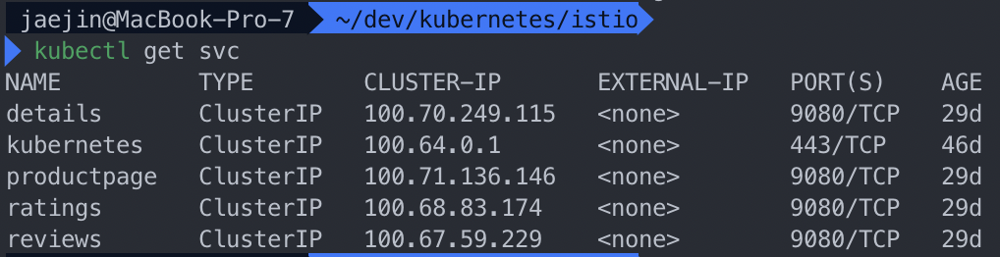

# Istio install and deploy sample applications

Istio란 sidecar pattern을 이용한 service mesh architecture 의 구현체인 오픈 플랫폼이다.

<!--more-->

[Istio #4 - Istio 설치와 BookInfo 예제](http://bcho.tistory.com/1297?category=731548)

조대협님 블로그를 참고하였습니다.

# Istio 설치

쿠버네티스 클러스터가 준비되어 있다면, Istio를 설치한다.

## Helm 설치

helm은 kubernetes의 nodejs의 npm 정도라고 생각하면 된다.
~~~bash
$ cd ~
$ curl -L https://git.io/getLatestIstio | sh -
$ cd istio-{version}
$ export PATH=$PWD/bin:$PATH
~~~

## Helm초기화

helm용 서비스 어카운트를 생성하고 helm을 초기화 한다.

~~~bash
$ kubectl create -f install/kubernetes/helm/helm-service-account.yaml
$ helm init --service-account tiller
~~~

## Istio 설치

설치시 모니터링을 위해 모니터링 도구인 `kiali, servicegraph, grafana` 설치 옵션을 설정한다.

~~~bash
helm install install/kubernetes/helm/istio \
--name istio \
--namespace istio-system \
--set tracing.enabled=true \
--set global.mtls.enabled=true \
--set grafana.enabled=true \
--set kiali.enabled=true \
--set servicegraph.enabled=true
~~~

약간의 시간이 지나고 설치되어있는지 pod 목록을 출력하면 다음과 같이 나온다.

## Istio 삭제

uninstall using kubectl

~~~bash
$ kubectl delete -f $HOME/istio.yaml
~~~

uninstall using Helm

~~~bash
$ helm delete --purge istio
~~~

If your Helm version is less than 2.9.0, then you need to manually cleanup extra job resource before redeploy new version of Istio chart:

~~~bash
$ kubectl -n istio-system delete job --all
~~~

delete the CRDs

~~~bash
$ kubectl delete -f install/kubernetes/helm/istio/templates/crds.yaml -n istio-system
~~~

# BookInfo 서비스 예제 설치

## Istio의 sidecar injection 활성화

Istio는 Pod에 envoy를 sidecar 패턴으로 삽입하여, 트래픽을 컨트롤하는 구조이다. 

Istio는 이 sidecar를 Pod 생성시 자동으로 주입 (inject)하는 기능이 있는데, 이 기능을 활성화 하기 위해서는 kubernetes의 `namespace에 istio-injection=enabled` 라는 라벨을 추가해야한다.

~~~bash
$ kubectl label namespace default istio-injection=enabled
~~~

추가 했다면, 다음과 같이 확인할 수 있다.

## Bookinfo 어플리케이션 배포

Bookinfo yaml 파일은 다음경로를 참고하면된다.

[istio/istio](https://github.com/istio/istio/blob/master/samples/bookinfo/platform/kube/bookinfo.yaml)

bookinfo.yaml 파일을 생성하고 다음 명령어로 실행하면 된다.

~~~bash
$ kubectl apply -f bookinfo.yaml
~~~

배포 완료 후 kubectl get pod 명령어를 실행해보면 다음과 같이 productpage, detail, rating 서비스가 배포되고, reviews 서비스는 v1 ~ v3 까지 배포되는걸 확이 할 수 있다.

kubectl get svc를 이용해 배포되어 있는 서비스를 확인하자.

모두 clusterIP 타입으로 배포 되어 있기 때문에 외부에서는 접근 불가하다. 

## Istio gateway 설정

이 서비스를 외부로 노출 시키는데, kubernetes의 Ingress나 Service는 사용하지 않고, `Istio의 gateway` 를 이용한다.

Istio의 gateway는 kubernetes의 커스텀 리소스 타입으로, Istio로 들어오는 트래픽을 받아주는 엔드포인트 역할을 한다.

여러 방법이 있지만 Istio에서는 디폴트로 배포되는  Gateway는 pod 형식으로 배포되어 Load Balancer 타입의 서비스로 서비스 된다.

먼저 Istio Gateway를 등록한 후에, Gateway를 통해 서비스할 호스트를 Virtaul Service로 등록한다.

조대협님 블로그

아래는 bookinfo에 대한 Gateway를 등록하는 yaml 파일이다.

~~~yaml
apiVersion: networking.istio.io/v1alpha3
kind: Gateway
metadata:
    name: bookinfo-gateway
spec:
    selector:
    istio: ingressgateway # use istio default controller
    servers:
    - port:
        number: 80
        name: http
        protocol: HTTP
    hosts:
    - "*"
~~~

selector를 이용해서 gateway 타입을 istio에서 디폴트로 제공하는 Gateway를 사용하였다. 그리고 HTTP 프로토콜을 80 포트에서 받도록 했다.

~~~yaml
apiVersion: networking.istio.io/v1alpha3
kind: VirtualService
metadata:
    name: bookinfo
spec:
    hosts:
    - "*"
    gateways:
    - bookinfo-gateway
    http:
    - match:
    - uri:
        exact: /productpage
    - uri:
        exact: /login
    - uri:
        exact: /logout
    - uri:
        prefix: /api/v1/products
    route:
    - destination:
        host: productpage
        port:
            number: 9080
~~~

spec에서 gateways 부분에 앞에서 정의한 bookinfo-gateway를 사용하도록 한다. 이렇게 하면 앞에서 만든 Gateway로 들어오는 트래픽은 이  Virtual Service로 들어와서 서비스 되는데, 여기서 라우팅 룰을 정의한다.

/productpage

/login

/logout

/api/v1/products

URL은 productpage:9080 으로 포워딩해서 서비스를 제공한다.

Istio에 미리 설치 되어 있는 gateway를 살펴보면, Istio default gateway는 pod로 배포되어 있는데, `istio=ingressgateway` 라는 라벨이 적용되어 있다.

service 도 확인해보면 다음과 같다.

이제 bookinfo를 istio gateway에 등록해서 외부로 서비스를 제공해보자.

~~~bash
$ istioctl create -f bookinfo-gateway.yaml
~~~

bookinfo-gateway.yaml 파일은 다음 링크에 있다.

[istio/istio](https://github.com/istio/istio/blob/master/samples/bookinfo/networking/bookinfo-gateway.yaml)

게이트웨이 배포가 끝나면 위의 service의 EXTERNAL-IP를 이용해서 접속해보자.

[http://IP/productpage](http://ip/productpage) 로 접속해보면 아래와 같이 정상적으로 작동한다.

## 모니터링 툴

서비스 설치가 끝났으면 간단한 테스트와 함께 모니터링 툴을 이용하여 서비스를 살펴보자. 

Istio를 설치하면 Prometheus, Grafana, Kiali, Jaeget 등의 모니터링 도구가 기본적으로 인스톨 되어 있다. 각각의 도구를 이용해서 지표들을 모니터링 해보자.

**Grafana를 이용한 서비스별 지표 모니터링**

Grafana를 이용해서 각 서비스들의 지표를 상세하게 모니터링 할 수 있다. 

먼저 확인전에 아래 스크립트를 이용해 간단하게 부하를 주자. 

~~~bash
for i in {1..100}; do 
    curl -o /dev/null -s -w "%{http_code}" http://35.197.159.13/productpage
done
~~~

다음 Grafana 웹 콘솔에 접근해야하는데, Grafana는 외부 서비스로 노출이 안되도록 설정이 되어 있기 때문에 kubectl을 이용해서 Grafana 콘솔에 트래픽을 포워딩 하도록 하자. 

Grafana는 3000번 포트에서 돌고 있기 때문에, [localhost:3000](http://localhost:3000) → Grafana Pod의 3000번 포트로 트래픽을 포워딩 하도록 설정하자.

~~~bash
kubectl -n istio-system port-forward $(kubectl -n istio-system get pod -l app=grafana -o jsonpath='{.items[0].metadata.name}') 3000:3000 &
~~~

다음 [localhost:3000](http://localhost:3000) 으로 접속해보면 Grafana 화면이 나올 것이다.

**Jaeger를 이용한 트렌젝션 모니터링**

다음은 jaeger를 이용해 개별 분산 트렌젝션에 대해서 각 구간별 응답 시간을 모니터링 할 수 있다.

Istio는 각 서비스별로 소요 시간을 수집하는데, 이를 jaeger 오픈소스를 쓰면 쉽게 모니터링이 가능하다.

마찬가지로 jaeger pod로 포트를 포워딩 해야한다.

~~~bash
kubectl port-forward -n istio-system $(kubectl get pod -n istio-system -l app=jaeger -o jsonpath='{.items[0].metadata.name}') 16686:16686 &
~~~

이후에 접속하면 Jaeger화면이 보인다.

하지만 나는 error 가 발생한다. ..

천천히 해결해야겠다..ㅠㅜ

**Servicegraph를 이용한 서비스 토폴로지 모니터링** 

마이크로 서비스는 서비스간 호출 관계가 복잡해서, 각 서비스의 관계를 시각화 해주는 툴이 있으면 유용한데, 대표적인 도구로는 service graph 라는 툴과 kiali 라는 툴이 있다. Bookinfo 예제를 위한 Istio 설정에는 servicegraph가 디폴트로 설치되어 있다.

마찬가지로 외부에 노출하기 위해 포트 포워딩 한다.

~~~bash
kubectl -n istio-system port-forward $(kubectl -n istio-system get pod -l app=servicegraph -o jsonpath='{.items[0].metadata.name}') 8088:8088 &
~~~

[http://localhost:8088/dotviz](http://localhost:8088/dotviz) 로 접속해보면 서비스들의 관계를 볼 수 있다.

어렵다..ㅠ
