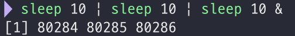
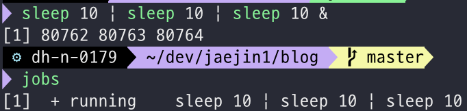

# Job Control

터미널에서 단순히 한나의 명령을 실행시키는게 아니라 `&`을 이용해 background job을 생성할 수 있다.

<!--more-->

## Job id와 Job specification

명령을 `&`을 이용해 backgroud로 실행시키면 결과로 job id와 process id를 보여준다. 

`[1]` 부분이 job id에 해당하고 그 뒤 `80284`, `80285`, `80286`은 process id(pid)에 해당된다.

만약 kill을 이용해 job에 신호를 보낼 때 job id를 사용한다면 pid와 구분할 수 없게 된다. 

그래서 job id 대신 job specification(jobspec)을 사용하는데 job id앞에 `%`을 붙여서 만든다.

jobspec을 이용해 kill을 하면 pgid (process group id)를 갖는 프로세스 들에게 모두 전달되므로 만약에 child process가 생성되어 실행 중이라면 함께 종료된다.

## Jobspec과 pid가 다른점

pid는 개별 프로세스를 나타내지만 jobspec은 파이프로 연결된 모든 프로세스를 포함한다.

## jobs

현재 job table 목록을 보여준다. `-l`을 이용하면 process id도 함께 보여준다. 옆에 `+`는 current job(가장 최근에 background상태가 된 job을 나타냄) `-`는 previous job을 나타낸다.

`fg`명령을 통해 `+`, `-`위치도 바꿀 수 있다.

## fg

현재 background에 stopped또는 running상태에 있는 job을 foreground로 실행하고 current job으로 만든다. 이후에 ctrl-z로 stopped되었을때 job table에는 `+`로 표신된다.

## bg

ctrl-z에 의해 현재 stopped 상태에 있는 background job에 SIGCONT 신호를 보내 background running 상태로 만든다. jobspec을 인수로 주지않으면 current job이 사용된다.

## job control 관련 키

* ctrl-c
    
    interrupt신호 (SIGINT)를 foreground job에 보내 종료시킨다.

* ctrl-z

    suspend신호 (SIGTSTP)를 foreground job에 보내 suspend 시키고 background에 있던 shell 프로세스를 foreground로 하여 명령을 입력 받을 수 있게 한다.

## input and output

* input

    입력은 foreground job에서만 받을 수 있다. background job에서 입력을 받게되면 SIGTTIN 신호가 전달되어 suspend된다.

* output

    출력은 기본적으로 현재 session에서 실행되고 있는 모든 job들이 공유한다. 그러므로 backgound job을 실행할 때 제대로 redirection처리를 하지 않으면 터미널로 출력되는 메시지들이 서로 섞이게 된다.
