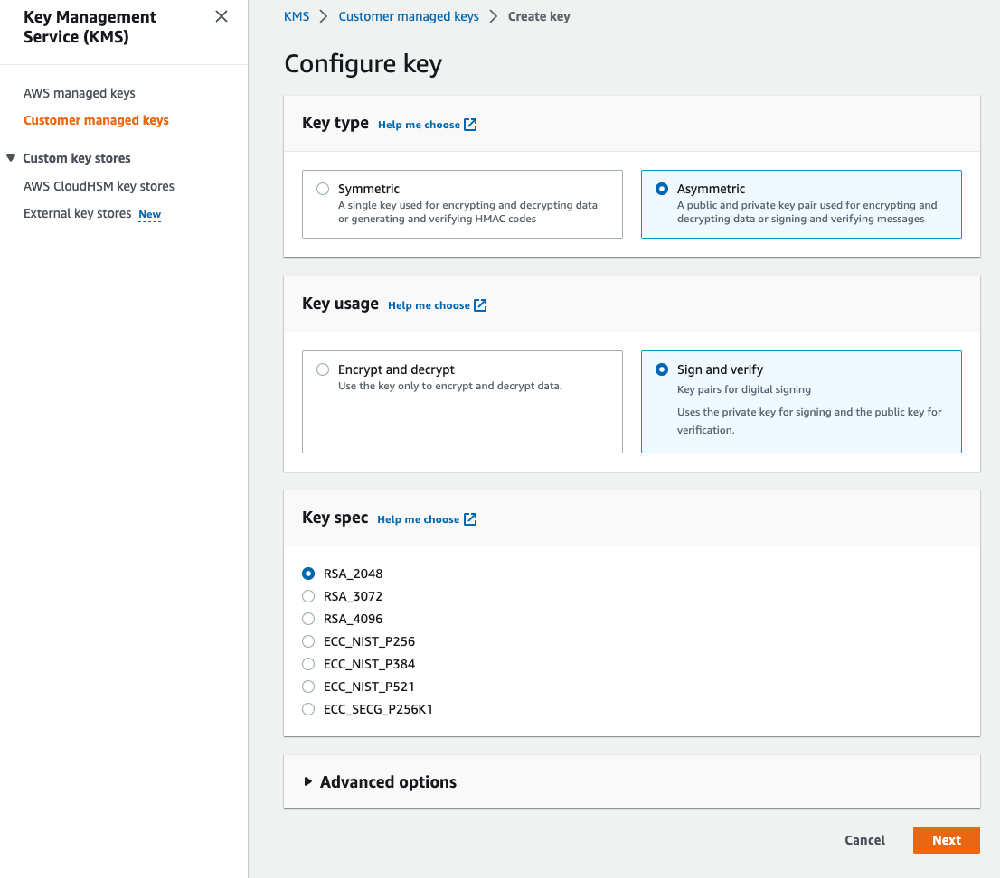
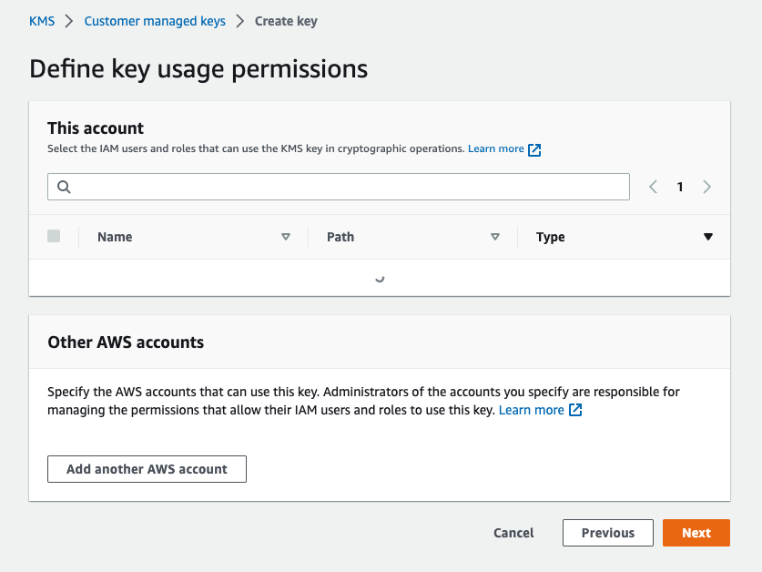
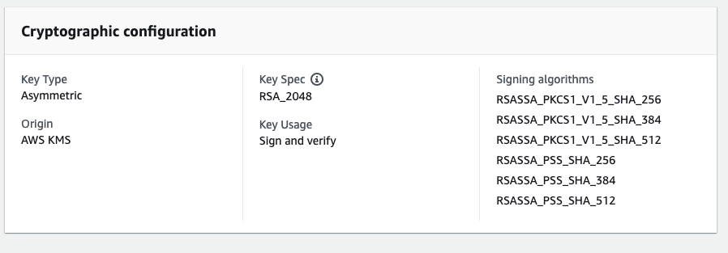
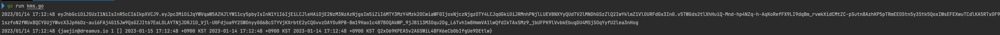
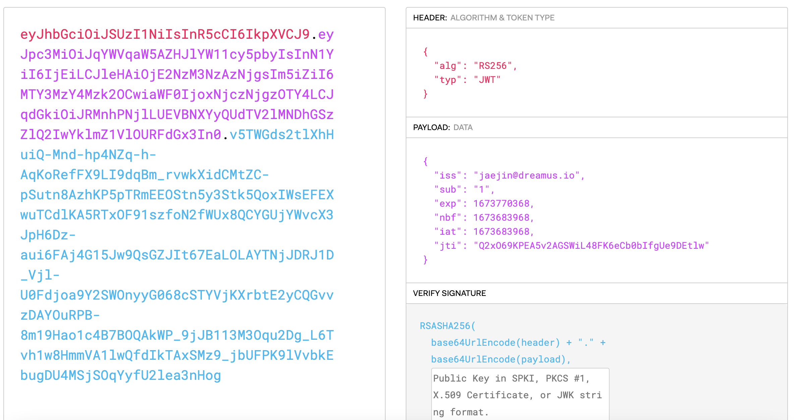

# JWT signing using AWS KMS


JWT 인증을 AWS KMS에서 key를 생성하여 이를 이용하여 token을 발급 받고 인증하는 것을 구현해보자

<!--more-->

기존엔 private key와 public key를 서버에다 생성하고 파일을 읽어서 token을 생성하고 인증을 했었다.

최근에 lambda로 api서버를 구성하면서 그런 구조는 이용할 수 없어 KMS를 이용해서 인증 처리를 진행해보고자 한다.

## KMS Key 생성



비대칭키, sign and verify를 선택하고 key는 RSA 2048을 선택하여 생성 한다.



해당 key를 사용하는 AWS IAM user나 role을 설정 한다. 

보통은 user에서 발급받은 key를 사용하지 않고 assume role이나 instance profile을 사용할 것이기 때문에 Role만 설정 하는 것이 좋다고 생각한다.

입력값은 이정도로 넣고 생성하게되면, Public key를 web console에서 확인할 수 있고 파일로 다운로드 받을 수 있지만 이를 API 콜로 받아오는 걸 짜보려고 한다.

생성했으니 KMS Key ID를 기억해두자.

## JWT in go

```go
func rsaSignKey() (*rsa.PrivateKey, error) {
	privKeyPath := filepath.Join(utils.GetRootPath(), "key folder", "private key file")

	signBytes, err := ioutil.ReadFile(privKeyPath)
	if err != nil {
		return nil, err
	}

	signKey, err := jwt.ParseRSAPrivateKeyFromPEM(signBytes)
	if err != nil {
		return nil, err
	}
	return signKey, nil
}

func main() {
    signKey, err := rsaSignKey()

    now := time.Now()
    jwtToken := jwt.NewWithClaims(jwt.GetSigningMethod("RS256"), &jwt.RegisteredClaims{
        ExpiresAt: jwt.NewNumericDate(now.Add(1 * time.Hour * 24)),
        IssuedAt:  jwt.NewNumericDate(now),
        NotBefore: jwt.NewNumericDate(now),
        ID:        "id",
        Issuer:    "jaejin",
        Subject:   "1",
    })

    str, err := jwtToken.SignedString(signKey)
    if err != nil {
		log.Fatalf("can not sign jwt %s", err)
	}

	log.Printf("%s\n", str)
}
```

golang에서 예전에 token인증을 위해 작성했던 코드이다. 기존엔 private key를 파일로 읽어서 SignedString function에 파라미터로 넣어주고 jwt pacakage 내부의 Sign fucntion으로 인해 jwt token값을 바로 받을 수 있었다.

jwt package 내부에 각 알고리즘 마다 [Sign, Verify 메소드들이 interface로 미리 정의](https://github.com/golang-jwt/jwt/blob/main/rsa.go) 되어 있고 이를 이용한다.

```go
type SigningMethod interface {
	Verify(signingString, signature string, key interface{}) error // Returns nil if signature is valid
	Sign(signingString string, key interface{}) (string, error)    // Returns encoded signature or error
	Alg() string                                                   // returns the alg identifier for this method (example: 'HS256')
}

func (m *SigningMethodRSA) Alg() string {
	return m.Name
}

// Verify implements token verification for the SigningMethod
// For this signing method, must be an *rsa.PublicKey structure.
func (m *SigningMethodRSA) Verify(signingString, signature string, key interface{}) error {
	var err error

	// Decode the signature
	var sig []byte
	if sig, err = base64.RawURLEncoding.DecodeString(signature); err != nil {
		return err
	}

	var rsaKey *rsa.PublicKey
	var ok bool

	if rsaKey, ok = key.(*rsa.PublicKey); !ok {
		return ErrInvalidKeyType
	}

	// Create hasher
	if !m.Hash.Available() {
		return ErrHashUnavailable
	}
	hasher := m.Hash.New()
	hasher.Write([]byte(signingString))

	// Verify the signature
	return rsa.VerifyPKCS1v15(rsaKey, m.Hash, hasher.Sum(nil), sig)
}

// Sign implements token signing for the SigningMethod
// For this signing method, must be an *rsa.PrivateKey structure.
func (m *SigningMethodRSA) Sign(signingString string, key interface{}) (string, error) {
	var rsaKey *rsa.PrivateKey
	var ok bool

	// Validate type of key
	if rsaKey, ok = key.(*rsa.PrivateKey); !ok {
		return "", ErrInvalidKey
	}

	// Create the hasher
	if !m.Hash.Available() {
		return "", ErrHashUnavailable
	}

	hasher := m.Hash.New()
	hasher.Write([]byte(signingString))

	// Sign the string and return the encoded bytes
	if sigBytes, err := rsa.SignPKCS1v15(rand.Reader, rsaKey, m.Hash, hasher.Sum(nil)); err == nil {
		return base64.RawURLEncoding.EncodeToString(sigBytes), nil
	} else {
		return "", err
	}
}
```

KMS를 이용하면 따로 private key를 받는 것이 아닌 KMS쪽으로 api를 날려서 인증을 받아야하기 때문에 이 interface를 재 정의하고 KMS쪽으로 인증을 받아오는 방식으로 구현하면 될 것 같다.

### KMS sign

```go
type KMSConfig struct {
	ctx    context.Context
	Client *kms.Client
	keyID  string
}

func NewKMSConfig(client *kms.Client, keyID string) *KMSConfig {
	return &KMSConfig{
		ctx:    context.Background(),
		Client: client,
		keyID:  keyID,
	}
}

type RSASigningMethod struct {
	Name string
	Hash crypto.Hash
}

func (m *RSASigningMethod) Alg() string {
	return m.name
}

func (m *RSASigningMethod) Sign(signingString string, key interface{}) (string, error) {
    kmsConfig, ok := key.(*KMSConfig)
	if !ok {
		return "", jwt.ErrInvalidKeyType
	}

	if !m.hash.Available() {
		return "", jwt.ErrHashUnavailable
	}

	hasher := m.hash.New()
	hasher.Write([]byte(signingString))

	signInput := &kms.SignInput{
		KeyId:            aws.String(kmsConfig.keyID),
		Message:          hasher.Sum(nil),
		MessageType:      types.MessageTypeDigest,
		SigningAlgorithm: types.SigningAlgorithmSpec("RSASSA_PKCS1_V1_5_SHA_256"),
	}

	signOutput, err := kmsConfig.Client.Sign(kmsConfig.ctx, signInput)
	if err != nil {
		return "", fmt.Errorf("signing digest: %w", err)
	}

    return base64.RawURLEncoding.EncodeToString(signOutput.Signature)
}
```

먼저 Sign 부분을 수정해보았다. 위의 jwt package와 다른 점은 sign 하는 부분을 crypto/rsa 쪽이 아니라 KMS를 호출하여 Sign을 진행한다.

signing 알고리즘은 KMS에서 제공해주는 알고리즘 중에 하나를 택한다. (RSASSA_PKCS1_V1_5_SHA_256)



### KMS verify

```go
var pubkeyCache = newPubKeyCache()

type pubKeyCache struct {
	pubKeys map[string]crypto.PublicKey
	mutex   sync.RWMutex
}

func newPubKeyCache() *pubKeyCache {
	return &pubKeyCache{
		pubKeys: make(map[string]crypto.PublicKey),
	}
}

func (c *pubKeyCache) Add(keyID string, key crypto.PublicKey) {
	c.mutex.Lock()
	defer c.mutex.Unlock()

	c.pubKeys[keyID] = key
}

func (c *pubKeyCache) Get(keyID string) crypto.PublicKey {
	c.mutex.RLock()
	defer c.mutex.RUnlock()

	return c.pubKeys[keyID]
}


func (m *RSASigningMethod) Verify(signingString, signature string, keyConfig interface{}) error {
	kmsConfig, ok := keyConfig.(*KMSConfig)
	if !ok {
		return jwt.ErrInvalidKeyType
	}

	sig, err := base64.RawURLEncoding.DecodeString(signature)
	if err != nil {
		return fmt.Errorf("decoding signature: %w", err)
	}

	if !m.hash.Available() {
		return jwt.ErrHashUnavailable
	}

	hasher := m.hash.New()
	hasher.Write([]byte(signingString))

	return verifyRSA(kmsConfig, m.hash, hasher.Sum(nil), sig)
}

func verifyRSA(kmsConfig *KMSConfig, hash crypto.Hash, hashedSigningString []byte, sig []byte) error {
	var rsaPublicKey *rsa.PublicKey

	cachedKey := pubkeyCache.Get(kmsConfig.keyID)
	if cachedKey == nil {
		getPubKeyOutput, err := kmsConfig.Client.GetPublicKey(kmsConfig.ctx, &kms.GetPublicKeyInput{
			KeyId: aws.String(kmsConfig.keyID),
		})
		if err != nil {
			return fmt.Errorf("getting public key: %w", err)
		}

		cachedKey, err = x509.ParsePKIXPublicKey(getPubKeyOutput.PublicKey)
		if err != nil {
			return fmt.Errorf("parsing public key: %w", err)
		}

		pubkeyCache.Add(kmsConfig.keyID, cachedKey)
	}

	rsaPublicKey, ok := cachedKey.(*rsa.PublicKey)
	if !ok {
		return errors.New("invalid key type for key")
	}

	if err := rsa.VerifyPKCS1v15(rsaPublicKey, hash, hashedSigningString, sig); err != nil {
		return fmt.Errorf("verifying signature locally: %w", err)
	}

	return nil
}
```

verify 부분은 public key가 사용되고 KMS에서 생성된 key의 public key를 가져와 이용한다.

verify할 때마다 public key를 요청하여 사용하는 것도 성능상 문제가 있으므로 이미 구현되어 있는 https://github.com/matelang/jwt-go-aws-kms를 살펴보니 public key를 메모리에 cache하고 있는 것을 볼 수 있었고 그대로 가져와 사용했다. 

### main

이제 구현은 되었으니 사용해볼 main function을 만들자.

```go
var (
	SigningMethodRS256 *RSASigningMethod
)

func main() {
    SigningMethodRS256 = &RSASigningMethod{
		name: "RS256",
		hash: crypto.SHA256,
	}

	jwt.RegisterSigningMethod(SigningMethodRS256.Alg(), func() jwt.SigningMethod {
		return SigningMethodRS256
	})

    
    ctx := context.TODO()
	cfg, err := config.LoadDefaultConfig(ctx,
		config.WithRegion("ap-northeast-2"),
	)
	if err != nil {
		log.Fatal(err)
	}

    // sts assume role
	stsclient := sts.NewFromConfig(cfg)
	awsCfg, err := config.LoadDefaultConfig(context.Background(),
		config.WithRegion("ap-northeast-2"),
		config.WithCredentialsProvider(aws.NewCredentialsCache(
			stscreds.NewAssumeRoleProvider(
				stsclient,
				"{role arn}",
			)),
		))

	now := time.Now()
	jwtToken := jwt.NewWithClaims(SigningMethodRS256, &jwt.RegisteredClaims{
		ExpiresAt: jwt.NewNumericDate(now.Add(1 * time.Hour * 24)),
		IssuedAt:  jwt.NewNumericDate(now),
		NotBefore: jwt.NewNumericDate(now),
		ID:        generateRandomString(40),
		Issuer:    "jaejin",
		Subject:   "1",
	})

    kmsClient := kms.NewFromConfig(awsCfg)

	kmsConfig := NewKMSConfig(kmsClient, keyID)

	str, err := jwtToken.SignedString(kmsConfig)
	if err != nil {
		log.Fatalf("can not sign jwt %s", err)
	}

	log.Printf("%s\n", str)

    claims := jwt.RegisteredClaims{}

	_, err = jwt.ParseWithClaims(str, &claims, func(token *jwt.Token) (interface{}, error) {
		return kmsConfig, nil
	})
	if err != nil {
		log.Fatalf("%s", err)
	}

	log.Printf("%v", claims)
}
```

AWS 인증을 STS Assume role을 이용해서 한번 더 임시 token을 발급해서 사용하기 위해 sts client와 role arn을 추가 적으로 설정하는 부분이 있었고

verify하는 부분에 `jwt.ParseWithClaims` 내부에서 등록된 jwt signing method를 처리하는 로직이 존재하여서 초반부분에 새로 구성한 RSASigningMethod을 등록한 부분까지 확인 할 수 있다.

```go
jwt.RegisterSigningMethod(SigningMethodRS256.Alg(), func() jwt.SigningMethod {
		return SigningMethodRS256
	})
```

이제 KMS를 이용해 JWT token을 발급받고 verify 하는 구성이 완료 되었다.






---

**참고**

* https://github.com/matelang/jwt-go-aws-kms
* https://github.com/golang-jwt/jwt

