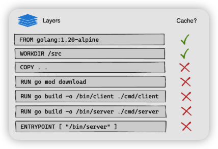
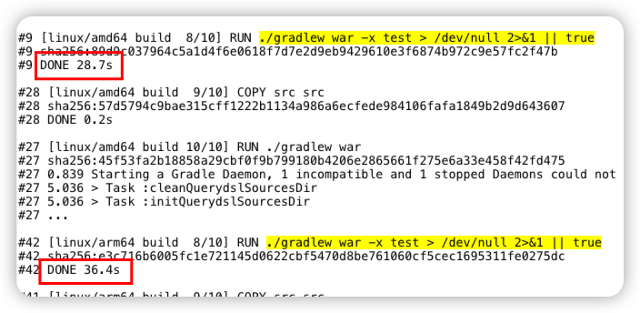
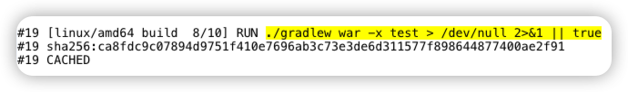

# docker layer cache를 이용해 빌드시간 단축하기


java언어로 직접 개발해보고 개발 서버에 올려 테스트 해보는 시간이 너무 오래걸린다.. 

갑자기 아이디어가 떠올랐는데 역시나 이미 적용한 사람들이 있었다. 


결론은 gradle 빌드시 사용하는 .gradle gradle cache를 사용하게 하는것.
gradle 의존성을 미리 다운로드 받아서 사용 하자!


<!--more-->

보통 빌드는 github action이나 jenkins와 같은 CI tool로 돌리고 있는데..

Dockerfile로 빌드하게 되면 사실상 base image의 conatiner에서 빌드를 하게 되어 빌드할때마다 새로 띄워서 하게 된다. 

처음엔 docker build 명령어로 빌드를 하고 있으니. 빌드시 다음과 같이 volume을 추가해 캐시를 build machine agent host와 공유하게 하는 것이였는데

```shell
$ docker build -v ~/.gradle:/home/gradle/.gradle -t ...
```

문제는..

jenkins agent host와 공유하고 있으니 모든 gradle 빌드의 캐시가 공유 되는 것. 그럴리는 없겠지만 뭔가 꼬일 수도 있겠다는 생각 (docker container에서 빌드하고 그냥 날려버리고 싶었음..)

그래서 Docker의 내부 구성의 docker layer를 이용해 꼼수를 좀 부려보자..



일단 docker build시 layer라는 개념이 존재하고. Dockerfile에서 line당 layer라고 보면 된다.

또한 이 layer는 기본적으로 캐싱하고 있고 변경이 일어난 하위 layer부터 캐시를 사용하지 않고 빌드를 진행하게 된다.

이를 이용해서 gradle 캐시파일들을 미리 docker layer에 캐싱해놓고 빌드할때 이를 가져다 쓰면 되지 않을까라는 생각을 했다.

이제.. 우리가 보통 사용하는 java빌드용 Dockerfile을 보자.

```dockerfile
FROM gradle:7.2.0-jdk11 AS build
COPY gradle gradle
COPY src src
COPY gradlew .
COPY build.gradle .
COPY gradle.properties .
COPY settings.gradle .
RUN chmod +x ./gradlew
RUN ./gradlew war
```

여기서 layer 별로 캐싱이 된다고 했는데, 보통 코드를 수정하면 src 폴더 내부의 파일들의 코드를 건드리고 배포를 진행한다.

즉 먼저 4번째 줄인 `COPY src src` 이부분을 빌드 바로 직전으로 보내면 COPY 하는 부분들은 거의 캐싱된 layer를 그대로 사용할 것이다. 이를 먼저 수정하면

```dockerfile
FROM gradle:7.2.0-jdk11 AS build
COPY gradle gradle
COPY gradlew .
COPY build.gradle .
COPY gradle.properties .
COPY settings.gradle .
COPY src src
RUN chmod +x ./gradlew
RUN ./gradlew war
```

이렇게 되고 3 ~ 7번째줄은 거의 변경이 없기 때문에 캐싱된 layer를 그대로 사용하게 될 것이다. 
여기서 하고 싶었던건 gradle의 캐시를 layer 캐시로 사용하고 싶었던것 
일단 결과적으로는 다음과 같이 해보자

```dockerfile
COPY gradle gradle
COPY gradlew .
COPY build.gradle .
COPY gradle.properties .
COPY settings.gradle .
RUN chmod +x ./gradlew
RUN ./gradlew war -x test > /dev/null 2>&1 || true
COPY src src
RUN ./gradlew war
```

여기서 봐야할껀 8번째줄인데 src 폴더를 COPY 하기전에 빌드를 돌린다. 여기서는 gradle의 캐시 파일을 생성됨

하지만 빌드는 실패하기에 /dev/null로 보내서 output 없게 하고 pipe를 줘서 성공인것 처럼 속이는 것이다.

`즉, 성공처럼 속여서 gradle 캐시 파일을 생성이 되고 layer 캐시로도 남게 되는 것`

그 이후 본격적인 빌드를 위해 src 폴더를 COPY 하고 빌드 시작.



* amd64 → 대략 28s
* arm64 → 대략 36s 

정도 걸리는 작업을 캐싱하니 이정도 시간이 단축될 거라 예상..



바로 캐싱된 docker layer를 사용해서 cached로 표기되고 바로 다음 빌드 진행

---

**참고**

* https://stackoverflow.com/questions/25873971/docker-cache-gradle-dependencies
* https://docs.docker.com/build/guide/layers/
