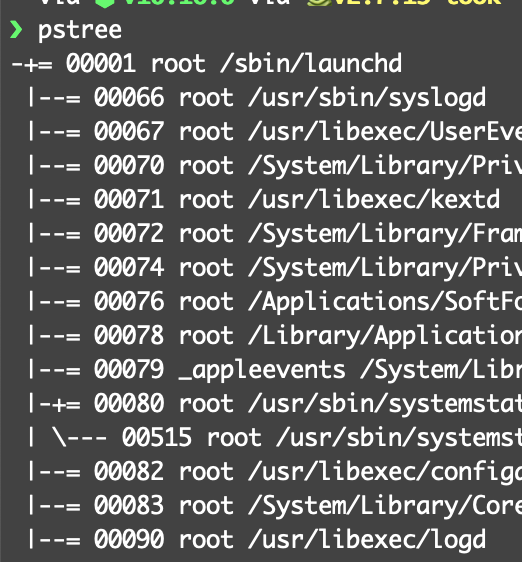

# Introduction to Linux Namespaces


linux에서 container가 내부적으로 어떻게 동작하는지 알아보자.

<!--more-->

namespace는 k8s에서 먼저 많이 접해봤는데, 각각 별개의 독립된 공간인 것처럼 환경을 제공하는 가상화 기술이다.

container기술이 이를 통해 만들어 졌다. 

Linux namespace는 6가지 종류가 있다.

1. UTS
2. IPC
3. PID
4. NS (FS)
5. NET
6. USER

## UTS

독립적인 Hostname할당 

현재 hostname은 다음과 같이 알 수 있다.

```bash
uname -n
```

unshare로 namespace를 만드는데 -u를 주면 UTS가 부모 프로세스와 공유가 안된 상태로 생성된다.

```bash
unshare -u /bin/bash
```

## IPC

inter process communication 

IPC는 프로세스간 서로 데이터를 주고 받는 경로를 뜻한다.
IPC는 Signal, Socket, pipe, semaphore, file locking, mutex등이 있다.
또한 프로세스간 데이터 교환 및 프로세스와 쓰레드간의 작업을 동기화 하는기능을 제공한다.

## PID

Linux에서 실행되는 모든 process들은 각각에 고유한 PID가 부여된다. kernel에서는 이 process들을 Tree 형태로 관리한다.



최상위 process는 init process라 하고 PID를 "1"을 가진다.

PID namespace에서 가지는 특징이 이 PID 1프로세스를 독립적으로 추가 할당해 주는 것이다.

PID를 1받았다고 해서 init process가 되는건 아니고 init process와 비슷하게 수행된다.

이는 OS에서 systemd 프로세스 뿐만 아니라 PID 충돌없이 실행 가능하게 해준다.

## NS (FS)

process Tree의 PID 1프로세스를 분기 시켜도 FS는 그대로 공유하고 있을것이다. 이유는 /proc를 아직 공유하고 있기 때문이다.

새로운 폴더를 만들고 /proc폴더를 mount시켜주면 독립적으로 FS를 관리할 수 있을 것이다.

## NET

namespace간 Network 충돌 방지한다.

`$ ip link list` 명령어로 현재 서버의 interface 정보를 확인 할 수 있다.

```bash
$ ip netns add {namespace}
```
새로운 namespace를 생성하고 다음과 같이 확인 할 수있다.

```bash
$ ip netns
```

독립된 namespace간 내부 통신도 가능한데 자세한건 다음 글에서 작성한다.

## USER

프로세스가 namespace 내부와 default namespace간에 각기 다른 사용자 및 그룹 ID를 가질 수 있게한다.
