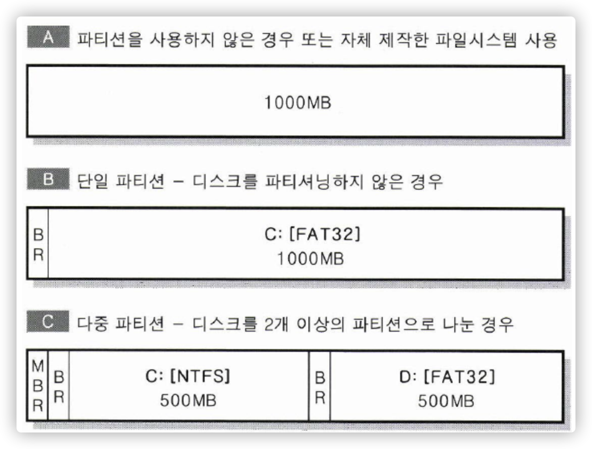

# Partition


파티션이란 연속된 저장 공간을 하나 이상의 연속되고 독립된 영역으로 나누어서 사용할 수 있도록 정의한 규약.

<!--more-->



파티션을 나누기 위해서는 저장장치에 연속된 공간에 있어야한다.  `하나의 하드디스크에는 여러 개의 파티션을 나눌 수 있지만, 두 개의 하드디스크를 가지고 하나의 파티션을 만들 순 없다.` 

## 사용 용도

1. 하나의 물리적인 디스크를 여러 논리 영역으로 나누어 관리를 용이하게 함.
2. OS영역과 Data 영역으로 나누어 OS 영역만 따로 포맷 및 관리를 하기 위해 사용
3. 여러 OS를 설치하기 위해 사용
4. 하드 디스크의 물리적인 배드 섹터로 특정 영역을 잘라서 사용하기 위해 사용한다.

## partition vs volume

볼륨은 OS나 Application등에서 이용할 수 있는 저장공간, 즉 섹터의 집합이다.

**연속된 공간이 아니여도 볼륨으로 볼 수 있다.** 즉 2개의 하드디스크를 사용하는 경우 하나의 하드디스크처럼 인식하여 사용할 수 있다.

보통 partition에 FS를 설정해주면 volume으로 보기에 partition역시 volume으로 볼 수 있다. 


## MBR

Master Boot Record

각 boot record는 각 partition의 첫 번째 섹터에 위치하며, 주로 해당 partition의 설치된 OS를 부팅하는 역할을 하게 된다. 즉 OS 실행을 위한 boot loader를 호출하는 것이다. partition을 나누지 않은 경우라면 boot record는 MBR에 있을 것이다.

단일 partition을 사용하는 경우 (플로피) boot record는 1개만 있을 것이므로 MBR이 필요없다.


MBR 호출과정


## linux partition

- Primary partition
    - 주 영역 파티션
    - 4개까지 생성가능 (1개 ~ 4개)
- Extend partition
    - 확장 영역 파티션
    - 1개 까지 생성가능
- Ligical partition
    - 논리 영역 파티션
    - SCSI 한 개의 총 partition 15개만 넘지 않게 사용가능 12개 이상은 좋지 않다고함

## 실습

### 파티션 나누기

aws에 ec2하나 띄워놓고 파티션을 나눠보장

먼저 파티션할 volume을 하나 생성하고 해당 ec2와 연결한다.

16GB짜리 disk를 연결했다.


```bash
$ fdisk -l
```


파티션 생성을 위해 파티션 설정으로 들어가자.

```bash
$ fdisk /dev/xvdd
```


- Primary 2GB
- Extended 4GB
    - Logical 2GB
    - Logical 2GB
- 사용안함 10GB

로 설정해보자.

1. 먼저 2G 짜리 Primary 파티션을 만들기 위해 `n` 입력


다음 primary 파티션을 생성해야하므로 p를 입력

순서대로 partition 번호는 1, sector 시작은 default, primary를 2GB로 설정하기위해서 last sector는 `+2G` 로 설정했다.


설정이 완료되었고 다시 p를 입력해 확인해보면 생성된 것을 확인 할 수 있다.


primary를 생성 했으므로 extended 파티션을 생성해보자.

똑같이 `n` 명령으로 생성하자.


xvdd2 이름으로 4GB Extended 파티션이 생성된 것을 확인 할 수 있다.

이제 Extended 파티션에 2개의 logical 파티션을 생성해보자.

Extended 파티션을 생성하고 `n` 명령어를 입력하면 extended 대신 logical이 보일 것이다.


이제 2개의 logical 파티션을 생성하자


2개째 설정하는 단계에서 `Value out of range` 에러가 발생했는데 Extended 파티션을 4GB로 설정했지만 완벽히 4GB가 아닐꺼라 남은 용량이 2GB보다 적어서 발생하는 에러 일 것이므로 default로 설정해주었더니 잘 할달 받은 것을 볼 수 있다.


`w` 명령으로 저장한다.


혹시 모르니 `partprobe` 명령으로 os에게 변경사항을 알려준다.

```bash
$ partprobe
```

다시 확인하면 잘 나눠진것을 볼 수 있다.


### 파일 시스템 설정

파티션 생성을 완료하면 물리적인 공간만 나눠놓았고 파일시스템을 지정해줘야한다. 

ext4 파일 시스템으로 /dev/xvdd1에 적용한다.

```bash
$ mkfs.ext4 /dev/xvdd1
```


xvdd5, xvdd6도 설정해주자.

xvdd5는 ext4로 , xvdd6은 ext3으로 설정해봤다.


### 마운트

파일시스템 설정까지 해줬으니 마운트를 해줘서 파티션한 공간을 사용해보자.

/dev/xvdd1, /dev/xvdd5, /dev/xvdd6 을 연결하기 위해 3개의 마운트 포인트가 필요하다.


마운트가 잘 된것을 볼 수 있고 user를 할당해서 home 디렉토리로 설정해보장


```bash
$ tail /etc/passwd
```


