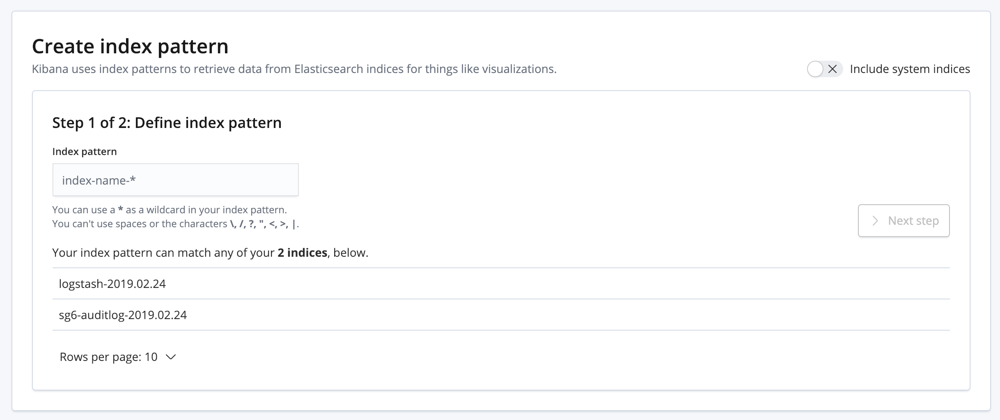

# Search guard kibana plugin

요번엔 Elasticsearch / kibana에 [Search Guard](https://search-guard.com/)를 연동시켜서 login 기능을 구현해보자.

<!--more-->

AWS Cloudformation으로 ICON Devnet을 AWS Marketplace에 등록하는 도중 Elasticsearch / kibana를 포함하려면 login 기능이 있어야 한다고한다.. 그에 대한 작업 중 일부를 기록하려고 한다.

일단 HTTPS를 이용하기 때문에 인증서를 직접 만들어도 되고, Search Guard에서 sample로 지원해주는 인증서가 있다. 후자를 선택했다.

전자의 경우 예~~전에 작업해놓은 것이 있는데 [https://github.com/jaejin1/docker-EK](https://github.com/jaejin1/docker-EK)를 참조 해보길 바란다.

먼저 docker-compose.yml 파일을 다음과 같이 만들었다.

~~~yaml
version: '3'
services:
  elasticsearch:
    image: docker.elastic.co/elasticsearch/elasticsearch:6.6.0
    container_name: elasticsearch
    volumes:
      - /home/ec2-user/elasticsearch/config:/usr/share/elasticsearch/config
      - /home/ec2-user/elasticsearch/data:/var/data/elasticsearch
      - /home/ec2-user/elasticsearch/log:/var/log/elasticsearch
    ports:
      - "9200:9200"
      - "9300:9300"
    environment:
      ES_JAVA_OPTS: "-Xmx1024m -Xms1024m"
    ulimits:
      nofile:
        soft: 90000
        hard: 90000
    networks:
      - ek

  kibana:
    image: docker.elastic.co/kibana/kibana:6.6.0
    container_name: kibana
    volumes:
      - /home/ec2-user/kibana/config:/usr/share/kibana/config
    ports:
      - "5601:5601"
    networks:
      - ek
    environment:
      NODE_OPTIONS: "--max-old-space-size=8192"
    depends_on:
      - elasticsearch

networks:
  ek:
    driver: bridge
~~~

docker-compose.yml 파일의 volumes의 conf 폴더에는 elasticsearch.yml 파일과 cloudformation에서 이상하게 6.x 버전은 ingest-geoip이라는 plugin이 필요해서 그 폴더들을 넣어주었다.

kibana의 volumes도 마찬가지로 conf폴더엔 kibana.yml 파일이 존재한다.

단순히 test 용이라면 따로 설정파일을 생성해놓을 필요는 없을 것이다.

이제 elasticsearch, kibana를 실행시켜보자.

~~~bash
$ docker-compose up -d
~~~

지금까지는 elasticsearch, kibana를 실행한 것 뿐이다. 
http://localhost:5601 로 접속해보면 kibana가 잘 뜰 것이다.

이제, Search Guard를 실행 시켜보자. 이 글에서는 docker-compose로 docker에서 실행 시켰기 때문에 docker-compose exec 명령으로 실행 시킨다. docker를 쓰지 않는다면 docker-compose exec -T ~~ 뒤 부터 실행하면 된다.

#### elasticsearch

~~~bash
$ docker-compose exec -T elasticsearch elasticsearch-plugin install --batch com.floragunn:search-guard-6:6.6.0-24.1
$ docker-compose exec -T elasticsearch bash plugins/search-guard-6/tools/install_demo_configuration.sh -y
$ docker-compose restart elasticsearch
$ docker-compose exec -T elasticsearch ./sgadmin_demo.sh
~~~

1. Search Guard plugin을 설치한다. 버전 정보는 [https://docs.search-guard.com/latest/search-guard-versions](https://docs.search-guard.com/latest/search-guard-versions) 을 참조하길 바란다.
2. demo_configuration 을 실행해 demo 설정을 한다. ( elasticsearch.yml 파일에 search guard 설정이 자동으로 추가된다. )
3. elasticsearch.yml 파일을 적용하기 위해 docker를 restart 한다.
4. sgadmin_demo.sh 를 실행해 Search Guard를 실행한다.

이후 부터는 http가 아닌 https로 접속을 해야 한다.

#### kibana

~~~bash
$ docker-compose exec -T kibana kibana-plugin install https://repo1.maven.org/maven2/com/floragunn/search-guard-kibana-plugin/6.6.0-18/search-guard-kibana-plugin-6.6.0-18.zip
$ docker-compose exec -T kibana bash -c 'echo searchguard.cookie.password: \"123567818187654rwrwfsfshdhdhtegdhfzftdhncn\" >> /usr/share/kibana/config/kibana.yml'
$ docker-compose restart kibana
~~~

1. kibana plugin을 설치한다. 버전은 위의 elasticsearch 부분을 참조하길 바란다.
2. kibana.yml파일에 설정을 추가한다.
3. kibana.yml 파일을 적용하기 위해 kibana를 restart 한다.

여기까지 완료 했다면, localhost:5601 or {serverIP}:5601 로 kibana에 접속해보면

다음과 같이 login 화면이 나올 것이다. admin / admin으로 접속하면 된다.

ID / Password 는 따로 권한을 줄 수 있는데 여기서 다루지는 않겠다. ID마다 보여주는 log의 index를 달리할 수 있다.

---

보통 Fluentd -> Elasticsearch -> Kibana로 log를 보낼 것인데, 만약 Search Guard를 적용했을 경우 Fluentd의 설정도 변경해줘야한다. http가 아닌 https로 보내야 하기 때문에..

보통 fluentd.conf 파일을 다음과 같이 작성하고 있었다면,

~~~bash

<match **> # Add your log tag to show in <>.
  @type copy
  <store> # Add your log tag to show in <>.
    @type file # Leave log file in path.
    path  /fluentd/log/docker_data.log
  </store>
  <store>
    @type elasticsearch
    host  {elasticsearch_ip}
    port  9200
    logstash_format true
    index_name logstash
    type_name logstash
    logstash_prefix logstash
  </store>
</match>

~~~

scheme https
ssl_verify false
user admin
password admin
ssl_version TLSv1_2

를 추가해서 다음과 같이 작성해야한다. 그러면 fluentd 에서 Elasticsearch로 log를 잘 보낼 것이다.

~~~bash

<match **> # Add your log tag to show in <>.
  @type copy
  <store> # Add your log tag to show in <>.
    @type file # Leave log file in path.
    path  /fluentd/log/docker_data.log
  </store>
  <store>
    @type elasticsearch
    host  {elasticsearch_ip}
    port  9200
    scheme https
    ssl_verify false
    user admin
    password admin
    ssl_version TLSv1_2
    logstash_format true
    index_name logstash
    type_name logstash
    logstash_prefix logstash
  </store>
</match>

~~~

index가 추가 되었다 ~~!

좀더 응용하면 user에 맞게 ID를 설정할 수 있고 보여주는 log를 달리할 수 있다.
