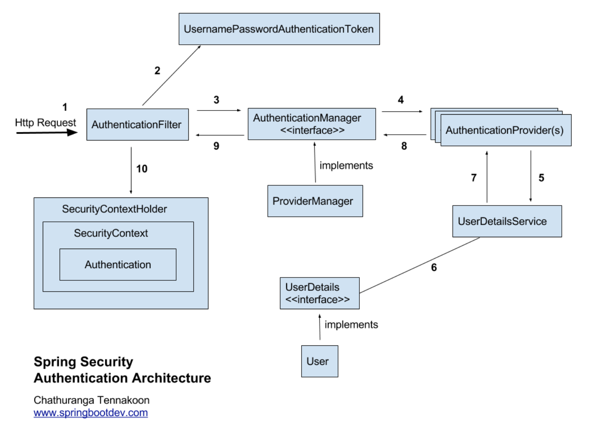

# Spring Security

spring security는 spring 기반의 애플리케이션의 보안(인증, 권한)을 담당하는 프레임워크이다.

spring security는 filter기반으로 동작하기 때문에 spring mvc와 분리되어 관리 되고 동작된다.

<!--more-->

## Spring Security 구조

### 인증 architecture

#### 1. Received the Http Request
Spring security는 series/chain filter들을 가진다. request가 오면 인증 및 허가 목적으로 chain filter를 통하게 된다. 또한 인증 메커니즘/모델에 기반한 관련 인증 필터를 찾을때 까지 filter chain을 가치게 된다. 

* HTTP 기본 인증은 `BasicAuthenticationFilter`에 도달할 때 까지 filter chain을 거친다.
* HTTP Digest 인증은 `DigestAuthenticationFilter`를 거친다.
* Login form으로 request가 오면 `UsernamePasswordAuthenticationFilter`를 거친다.
* X509 인증 request가 오면 X509에 도달할때 까지 filter chain을 거친다. `X509AuthenticationFilter`

다양한 filter들은 밑에, 종류들을 나열해놨다.

#### 2. Creates AuthenticationToken based on user credentials

인증요청이 `AuthenticationFilter`에 의해 수신되면, 수신된 request로 부터 username, password를 추출한다. 추출된 사용자 자격 증명을 기반으로 인증 개체를 생성한다.

만약 credential이 username, password면 이를 통해 `UsernamePasswordAuthenticationToken`을 username, password로 생성한다.

#### 3. Delegating created AuthenticationToken for AuthenticationManagager

이후 `UsernamePasswordAuthenticationToken` object를 Authenticationmanager의 인증방법을 호출하는데 사용된다.

ProviderManager에는 사용자 요청을 인증하는 데 사용해야 하는 구성된 AuthenticationProvider 목록이 있다. ProviderManager는 제공된 각 AuthenticationProvider를 살펴보고 전달된 Authentication Object를 기반으로 사용자를 인증하려고 시도한다.

#### 4. Trying to authenticate with list of AuthenticationProvider

`AuthenticationProvider`는 인증 객체를 이용해 사용자를 인증하려고 시도한다.

provider

* CasAuthenticationProvider
* JaasAuthenticationProvider
* DaoAuthenticationProvider
* OpenIDAuthenticationProvider
* RememberMeAuthenticationProvider
* LdapAuthenticationProvider

#### 5. UserDetailsService Required

일부 AuthenticationProvider는 사용자 이름을 기반으로 사용자 세부 정보를 검색하기 위해 UserDetailsService를 사용할 수 있다.

#### 6 & 7. UserDetails or User Object

UserDetailsService는 사용자 이름을 기반으로 UserDetails를 검색한다.

#### 8. Authentication Object Or AuthenticationException

사용자가 성공적으로 인증되면 완전히 채워진 인증 객체가 반환된다.

#### 9. Authentication is done

AuthenticationManager는 완전히 채워진 Authentication 개체를 관련 Authentication Filter로 다시 반환한다.

#### 10. Setting up Authentication Object in SecurityContext

그런 다음 관련 AuthenticationFilter는 획득한 인증 개체를 향후 필터 사용을 위해 SecurityContext에 저장한다.

### security의 filter

아까 위에서 말한 filter들의 종류들을 보자.

1. SecurityContextPersistenceFilter : SecurityContextRepository 에서 SecurityContext를 가져오거나 저장하는 역할.
2. LogoutFilter : 설정된 로그아웃 URL로 오는 요청을 감시하고 로그아웃 처리를한다.
3. BasicAuthenticationFilter : HTTP 기본 인증 헤더를 감시하여 처리한다.
4. RequestCacheAwareFilter : 로그인 성공 후 원래 요청 정보를 재구성하기 위해 사용한다.
5. UsernamePasswordAuthenticationFilter : username과 password를 사용하는 form 기반 인증에서 설정된 login URL로 오는 요청을 감시하며 유저 인증을 처리한다.
6. DefaultLoginPageGeneratingFilter : 인증을 위한 login form URL을 감시한다.
7. SecurityContextHolderAwareRequestFilter : HttpServletRequestWrapper를 상속한 SecurityContextHolderAwareRequestWapper 클래스로 HttpServletRequest 정보를 감싼다.
8. AnonymousAuthenticationFilter : 이 필터가 호출되는 시점까지 사용자 정보가 인증 되지 않았다면, 인증토큰에 사용자가 익명 사용자로 나타난다.
9. SessionManagementFilter : 인증된 사용자와 관련된 모든 세션을 추적한다.
10. ExceptionTranslationFilter : 보호된 요청을 처리하는 중에 발생할 수 있는 예외를 위암하거나 전달한다.
11. FilterSecurityInterceptor : AccessDecisionManager로 권한부여 처리를 위임해서 접근 제어 결정을 쉽게 해준다.

### Authentication

모든 접근 주체는 Authentication을 생성한다. 이것은 SecurityContext에 보관되고 사용된다. security의 세션들은 내부 메모리(SecurityContextHolder)에 쌓고 꺼내 쓰는것이다.

### AuthenticationManager

User의 요청내에 담긴 Authentication을 AuthenticationManager에 넘겨주고 AuthenticationManager를 구현한 ProviderManager가 처리한다. 

~~~java
public interface Authentication extends Principal, Serializable { 
    Collection<? extends GrantedAuthority> getAuthorities(); // Authentication 저장소에 의해 인증된 사용자의 권한 목록 
    Object getCredentials(); // 주로 비밀번호 
    Object getDetails(); // 사용자 상세정보 
    Object getPrincipal(); // 주로 ID 
    boolean isAuthenticated(); //인증 여부 
    void setAuthenticated(boolean isAuthenticated) throws IllegalArgumentException; 
}
~~~

## 설정

1. 의존성 추가
2. security 설정

### 의존성추가

* gradle

~~~java
implementation 'org.springframework.boot:spring-boot-starter-security'
~~~

### security 설정

~~~java
@Configuration
@EnableWebSecurity
@AllArgsConstructor
public class securityConfig extends WebSecurityConfigurerAdapter {
    private UserService userService;

    @Bean
    public PasswordEncoder passwordEncoder() {
        return new BCryptPasswordEncoder();
    }

    @Override
    public void configure(WebSecurity web) throws Exception {
        web.ignoring().antMatchers("/css/\*\*", "/js/\*\*", "/img/\*\*", "/lib/\*\*");
        super.configure(web);
    }

    @Override
    protected void configure(HttpSecurity http) throws Exception {
        http.authorizeRequests()
                .antMatchers("/user/myinfo/**").hasRole("USER")
                .antMatchers("/admin/**").hasRole("ADMIN")
                .antMatchers("/**").permitAll();

        http.csrf().disable();
        http.formLogin()
                .loginPage("/user/login")
                .failureUrl("/login-error")
                .defaultSuccessUrl("/user/login/result", true)
                .usernameParameter("username")
                .passwordParameter("password");

        http.logout()
                .logoutRequestMatcher(new AntPathRequestMatcher("/user/logout"))
                .logoutSuccessUrl("/user/logout/result")
                .invalidateHttpSession(true);

        http.exceptionHandling().accessDeniedPage("/user/denied");

    }

    @Override
    public void configure(AuthenticationManagerBuilder auth) throws Exception {
        auth.userDetailsService(userService).passwordEncoder(passwordEncoder());
    }
// 만약 default로 유저를 설정하고 싶다면
//
//    @Override
//    protected void configure(AuthenticationManagerBuilder auth) throws Exception {
//        auth.inMemoryAuthentication()
//                .withUser("user")
//                .password(passwordEncoder().encode("1234"))
//                .roles("USER");
//    }
}
~~~

#### @EnableWebSecurity

@Configuration 클래스에 @EnableWebSecurity 어노테이션을 추가하여 spring security클래스라고 명시해준다.

#### passwordEncoder()

BCryptPasswordEncode는 spring security에서 제공하는 비밀번호 암호화 객체이다. Service에서 비밀번호를 암호화 할 수 있도록 Bean으로 등록한다.

다음으로 Configure() 메서드를 오버라이딩 하여 security설저을 해준다.

#### configure(WebSecurity web)

WebSecurity는 FilterChainProxy를 생성하는 필터이다.

web.ignoring().antMatchers("/css/**", "/js/**", "/img/**", "/lib/**");
와 같이 사용하고 

해당 경로의 파일들은 spring security가 무시할 수 있도록 설정한다.

#### configure(HttpSecurity http)

HttpSecurity를 통해 HTTP요청에 대한 웹 기반 보안 설정을 할 수 있다.

* authorizeRequests()
    * HttpServletRequest에 따라 접근을 제한한다.
    * antMatchers() 메서드로 특정 경로를 지정하고 permitAll(), hasRole() 메서드로 역할에 따른 접근 설정을 잡아준다.

* formlogin()
    * form기반으로 인증하도록 해준다. 로그인 정보는 기본적으로 HttpSession을 이용한다.
    * 기본적으로 spring security에서 제공되는 login form을 사용할 수 있는데 /login으로 접근하면 된다.
    * .loginPage("/user/login")
        * 기본으로 제공되는 form말고 커스텀 form을 사용하고 싶으면 loginPage() 메서드를 이용한다.
        * 이 때 커스텀 로그인 form의 action 경로와 loginPage()의 파라미터 경로가 일치해야 인증을 처리할 수 있다.
* logout()
    * 로그아웃을 지원하는 메서드. 
    * 기본적으로 /logout에 접근하면 HTTP 세션을 제거한다.
    * .logoutRequestMatcher(new AntPathRequestMatcher("/user/logout"))
        * 기본 /logout이 아닌 다른 URL로 커스텀한다.
    * .invalidateHttpSession(true);
        * HTTP 세션을 초기화 한다.

#### configure(AuthenticationManagerBuilder auth)

spring security 에서 모든 인증은 AuthenticationManager를 통해 이뤄지며 AuthenticationManager를 생성하기 위해서는 AuthenticationManagerBuilder를 사용한다.

인증을 위해서 UserDetaulService를 통해 필요한 정보들을 가져온다.

service 클래스에서는 UserDetailsService 인트퍼에시를 implements하여, loadUserByUsername() 메서드를 구현하면된다.

## 실습 예제

**UserController**
~~~java
@Controller
@AllArgsConstructor
public class UserController {

    private UserService userService;

    @GetMapping(value = "/index")
    public String home() {
        return "/index";
    }

    // 회원가입 페이지
    @GetMapping("/user/signup")
    public String dispSignup() {
        return "/signup";
    }

    // 회원가입 처리
    @PostMapping("/user/signup")
    public String execSignup(UserDto memberDto) {
        userService.joinUser(memberDto);
        return "redirect:/user/login";
    }

    // 로그인 페이지
    @GetMapping("/user/login")
    public String dispLogin() {
        return "/login";
    }

    // 로그인 결과 페이지
    @GetMapping("/user/login/result")
    public String dispLoginResult() {
        return "/loginSuccess";
    }

    // 로그아웃 결과 페이지
    @GetMapping("/user/logout/result")
    public String dispLogout() {
        return "/logout";
    }

    // 접근 거부 페이지
    @GetMapping("/user/denied")
    public String dispDenied() {
        return "/denied";
    }

    // 내 정보 페이지
    @GetMapping("/user/info")
    public String dispMyInfo() {
        return "/myinfo";
    }

    // 어드민 페이지
    @GetMapping("/admin")
    public String dispAdmin() {
        return "/admin";
    }
}
~~~

**UserService**
~~~java
@Service
@AllArgsConstructor
public class UserService implements UserDetailsService {

    private UserRepository userRepository;

    @Transactional
    public UserEntity joinUser(UserDto userDto) {
        BCryptPasswordEncoder passwordEncoder = new BCryptPasswordEncoder();
        userDto.setPassword(passwordEncoder.encode(userDto.getPassword()));
        return userRepository.save(userDto.toEntity());
    }

    @Override
    public UserDetails loadUserByUsername(String userEmail) throws UsernameNotFoundException {
        Optional<UserEntity> userEntityWrapper = userRepository.findByEmail(userEmail);
        UserEntity userEntity = userEntityWrapper.get();

        List<GrantedAuthority> authorities = new ArrayList<>();

        if(("admin@example.com").equals(userEmail)) {
            authorities.add(new SimpleGrantedAuthority(Role.ADMIN.getValue()));
        } else {
            authorities.add(new SimpleGrantedAuthority(Role.USER.getValue()));
        }
        return new User(userEntity.getEmail(), userEntity.getPassword(), authorities);
    }
}
~~~

**UserEntity**
~~~java
@NoArgsConstructor(access = AccessLevel.PROTECTED)
@Getter
@Entity
public class UserEntity extends BaseTimeEntity {

    @Id
    @GeneratedValue(strategy = GenerationType.IDENTITY)
    private Long id;

    @Column(length = 20, nullable = false)
    private String email;

    @Column(length = 100, nullable = false)
    private String password;

    @Builder
    public UserEntity(Long id, String email, String password) {
        this.id = id;
        this.email = email;
        this.password = password;
    }
}
~~~

**UserRepository**
~~~java
public interface UserRepository extends JpaRepository<UserEntity, Long> {
    Optional<UserEntity> findByEmail(String userEmail);
}
~~~

**Role**
~~~java
@AllArgsConstructor
@Getter
public enum Role {
    ADMIN("ROLE_ADMIN"),
    USER("ROLE_USER");

    private String value;
}
~~~

**UserDto**

~~~java
@Getter
@Setter
@ToString
@NoArgsConstructor
public class UserDto {

    private Long id;
    private String email;
    private String password;
    private LocalDateTime createdDate;
    private LocalDateTime modifiedDate;

    public UserEntity toEntity(){
        return UserEntity.builder()
                .id(id)
                .email(email)
                .password(password)
                .build();
    }

    @Builder
    public UserDto(Long id, String email, String password) {
        this.id = id;
        this.email = email;
        this.password = password;
    }
}
~~~

---

**`참고`** 

- https://springbootdev.com/2017/08/23/spring-security-authentication-architecture/#more-54
- https://sjh836.tistory.com/165
- https://victorydntmd.tistory.com/328
