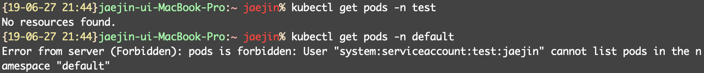

# Configuring kubectl by using serviceAccount token

K8s를 사용하면서 사용자별로 Role을 정해줄 수 있다.

<!--more-->

1. ServiceAccount 생성
2. Role 생성
3. RoleBinding 생성

ServiceAccount의 token을 얻어서 kubectl에 사용해보자.

## ServiceAccount, Role, RoleBinding

~~~yaml
apiVersion: v1
kind: ServiceAccount
metadata:
  namespace: test
  name: jaejin
---
apiVersion: rbac.authorization.k8s.io/v1
kind: Role
metadata: 
  namespace: test
  name: pod-reader
rules:
- apiGroups: [""]
  resources: ["pods"]
  verbs: ["get", "watch", "list"]

---
apiVersion: rbac.authorization.k8s.io/v1
kind: RoleBinding
metadata:
  name: read-pods
  namespace: test
subjects:
- kind: ServiceAccount
  name: jaejin
  namespace: test
roleRef:
  kind: Role
  name: pod-reader
  apiGroup: rbac.authorization.k8s.io
~~~

위의 코드를 보고 설명하면,
먼저 계정? 으로 쓰일 ServiceAccount를 생성한다.  
test namespace에 jaejin이란 이름으로 생성된다.  
Role은 pods의 정보를 가져온다는 것을 의미한다.  
RoleBinding은 ServiceAccount와 Role을 연결한다.


물론 test란 namespace는 미리 생성했다.


~~~bash
$ kubectl get sa -n test

NAME      SECRETS   AGE
default   1         16s
jaejin    1         13s
~~~

jaejin 이란 ServiceAccount가 생성되었다. Role과 RoleBinding도 확인하자.

~~~bash
$ kubectl get role -n test

NAME         AGE
pod-reader   51s
~~~

~~~bash
$ kubectl get rolebinding -n test

NAME        AGE
read-pods   77s
~~~

이제 이것들을 가지고 token을 뽑아 내자.

~~~bash
$ export serviceaccount=jaejin
$ export namespace=test

$ export server=$(kubectl config view | grep server | cut -f 2- -d ":" | tr -d " ")
$ export name=$(kubectl get secret -n $namespace | grep $serviceaccount-token | cut -f -1 -d " ")
$ export ca=$(kubectl get secret/$name -n $namespace -o jsonpath='{.data.ca\.crt}')
$ export token=$(kubectl get secret/$name -n $namespace -o jsonpath='{.data.token}' | base64 -D)
~~~

위의 명령을 실행하면 token, ca 등의 정보를 가져올 수 있다.

kubectl의 config 파일을 만들어보자.

~~~bash
echo "
apiVersion: v1
kind: Config
clusters:
- name: default-cluster
  cluster:
    certificate-authority-data: ${ca}
    server: ${server}
contexts:
- name: default-context
  context:
    cluster: default-cluster
    namespace: ${namespace}
    user: default-user
current-context: default-context
users:
- name: default-user
  user:
    token: ${token}
" > config
~~~

config 파일이 만들어지고 이를 `~/.kube/config`의 경로로 저장한다. 

이제 `kubectl` 명령을 날려보자. test namespace의 pods의 정보만 가져 올 수 있을 것이다.

Role을 이용해 사용자별로 권한을 다르게 줄 수 있다 !!

