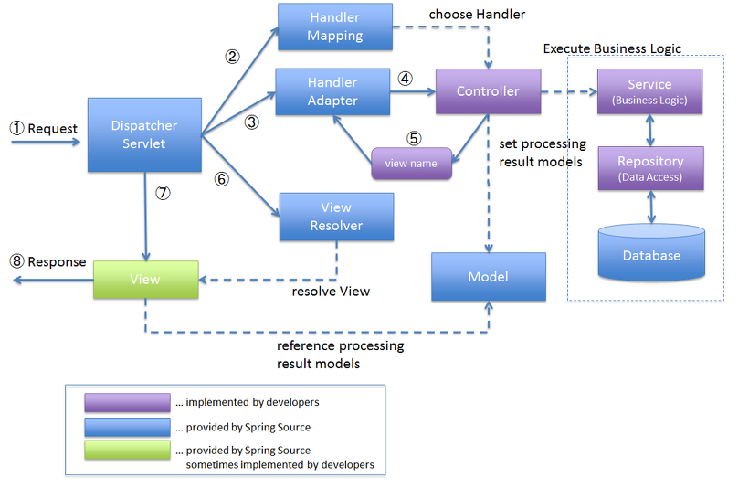
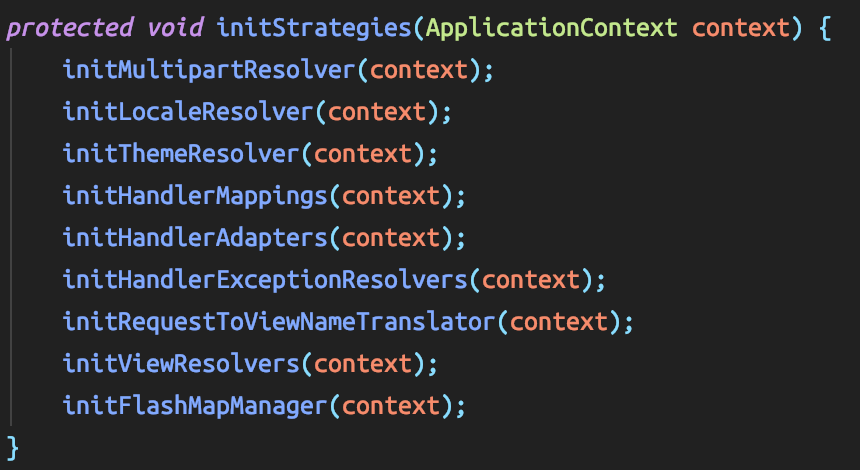
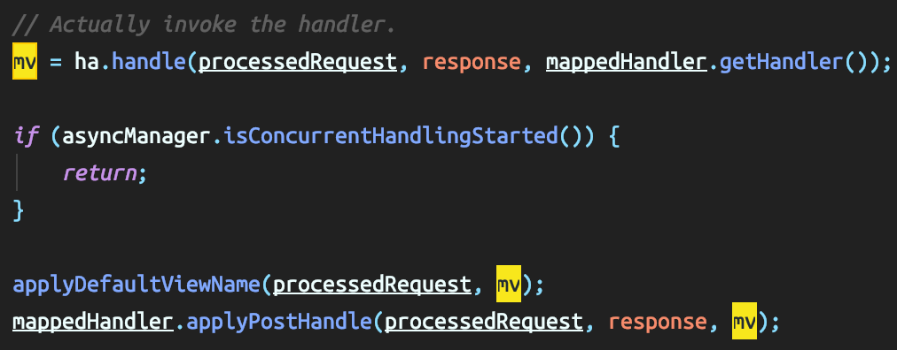

# Spring MVC와 DespatcherServlet

[이전글](https://jaejin1.github.io/springmvcbasic/)에서 잠깐 보았던 것을 전체적으로 봐보자.

<!--more-->

출처 : https://lazymankook.tistory.com/69

## DispatcherServlet등록
Dispatcher Servlet이 클라이언트의 모든 요청을 받는다. DispatcherServlet을 사용하기 위해 어딘가에 객체로 등록되어 있을 것이다.

요즘엔 사용안하는 web.xml파일에 정보들을 적어서 사용했었다. 여기에 DispatcherServlet을 url패턴과 함께 작성하여 DispatcherServlet은 FontController의 역할을 하기 때문에 모든 url을 DispatcherServlet을 거치도록 설정 해놓을 것이다. 

`Servlet 3.0` 이상 부터 WebApplicationInitializer구현 또는 AbstractAnnotationConfigDispatcherServletInitializer 상속으로 web.xml에서 하던 설정을 java config로써 코드로 작성할 수 있다.  
java config를 통해 설정해 classpath내에 두면, SpringServletContainerInitializer가 서블릿을 초기화 할 때 감지한다.

## DispatcherServlet 초기화

DispatcherServlet이 생성 후 초기화 될때, initStrategies(ApplicationContext context) 메소드를 실행해 DeispatcherServlet에 관련된 Bean들을 초기화한다.

초기화시 Bean이 존재하는지 찾고 없으면 default 설정에 따라 Bean을 생성하거나 아무 작업을 안 시킬 수도 있다.

이제 DispatcherServlet이 가지는 전략 인터페이스를 보자.

### MultipartResolver

multipart 파일 업로드 요청에 대해 해선하여 변환하는 전략 인터페이스.

### LocaleResolver

웹 기반의 locale 결정 전략 인터페이스.

### ThemeResolver

웹 기반의 Theme 결정 전략 인터페이스.

### HandlerMapping

Request와 핸들러 객체를 Mapping을 정의하는 인터페이스이다.  
일반적으로 @RequestMapping을 이용한 핸들러 Mapping 전략이다.  
default로 선언되는 Bean은 [BeanNameUrlHandlerMapping](https://jaejin1.github.io/2019/12/11/java/spring/springmvcBasic/#HeanNameUrlHandlerMapping), DefaultAnnotationHandlerMapping 이다.

### HandlerAdapter

Spring MVC의 Service Provider Interface. Controller의 구현 전략 인터페이스 이다.  
HandlerMapping이 핸들러를 찾아주면, HandlerAdapter가 해당 컨트롤러의 핸들러에 전달하기 위한 Adapter라고 보면 됨.  
HandlerAdapter 인터페이스를 보면 modelAndView를 리턴하는 handle이라는 메소드가 있다.

Spring의 Controller 종류는 4가지가 있다. Servlet, Controller, HttpRequestHandler, @Controller 어노테이션.

각 Controller를 DispatcherServlet에 연결시켜주는 Adapter가 하나씩 있어야 하므로 handlerAdapter도 4개가 있어야한다.

### HandlerExceptionResolver

Handler Mapping이나 Controller 실행 도중 발생한 예외를 다루는 인터페이스 이다.

### RequestToViewNameTranslator

Controller에서 View를 지정하지 않았을때, Request를 참고하여 내부적으로 View 이름을 생성해준다.

### ViewResolver

Controller에서 Request를 처리하고 생성하는 결과물에 대한 View 처리 전략 인터페이스.

Controller가 `return "index.jsp";` 와 같이 이름만 남겨줘도 ViewResolver가 ModelAndView객체로 변경해서 돌려준다.

prefix와 suffix를 좋바하는 로직도 이 안에 포함되어 있다.

### FlashmapManager

FlashMap객체를 retrieve & save 하는 전략 인터페이스 이다.

위의 모든 전략 인터페이스의 처리 과정은 Bean에 이뤄진다.  
또한 커스터마이징이 필요한 부분은 인터페이스를 구현해 Spring Bean으로 등록하면 된다.  
등록하면 DispatcherServlet이 초기화 될 때 Bean이 주입된다.

Default Bean은 @EnableMvc를 사용할 때 생성된다. default Bean 설정은 spring-mvc 프로젝트내 DispatcherServlet.properties에 선언되어 있다.

요청을 받았을 때 순서대로 보면

1. Handler Mapping

DispatcherServlet이 요청을 받으면 처음 거치는 곳인데 요청받은 URL에 해당하는 Controller를 찾아준다. HandlerMapping을 따로 설정하지 않으면 RequestMappingHandler(@RequestMapping)와 [SimpleUrlHandlerMapping(URI 경로 패턴)](https://jaejin1.github.io/2019/12/11/java/spring/springmvcBasic/#SimpleUrlHandlerMapping)이 기본 구현으로 된다.

2. Handler Adapter

HandlerMapping으로 결정된 Controller의 메서드를 호출 하는 역할을 한다.  
DispatcherServlet이 Handler가 어떤 방식으로 구현되어 있는지 신경 쓰지 않게 하기 위해서다.

3. Controller, Service, Repository

DB의 Data Access를 통해 나온 데이터를 Model에 저장하고 View를 정하여 View Resolver에 전달한다.

4. View Resolver

어떤 종류의 view를 사용할지 선택한다. 선택된 view는 데이터를 이용해 페이지를 완성하고 클라이언트에 전달한다.

---

**`참고`**

- https://lazymankook.tistory.com/69

