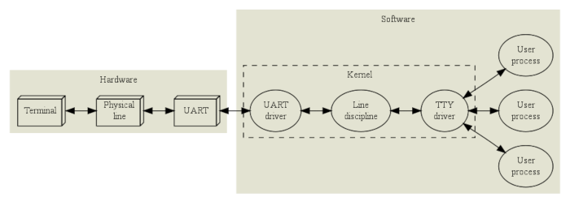
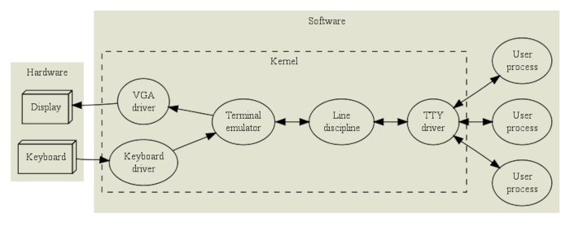
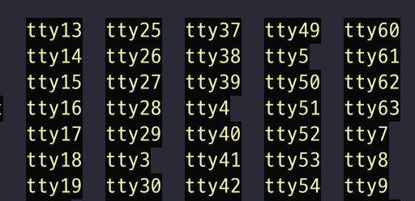
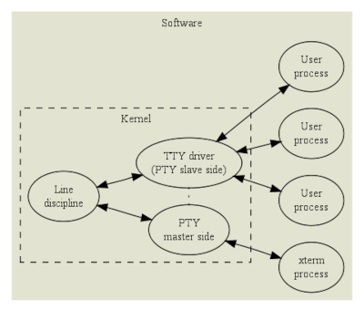
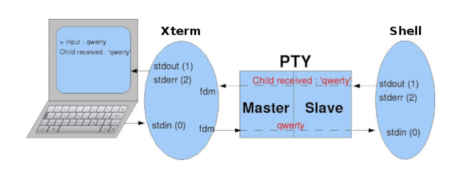
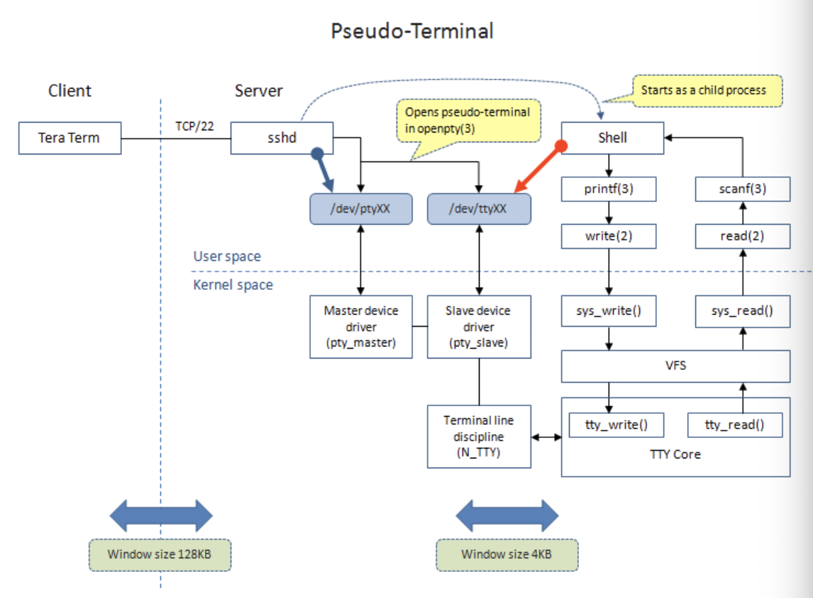
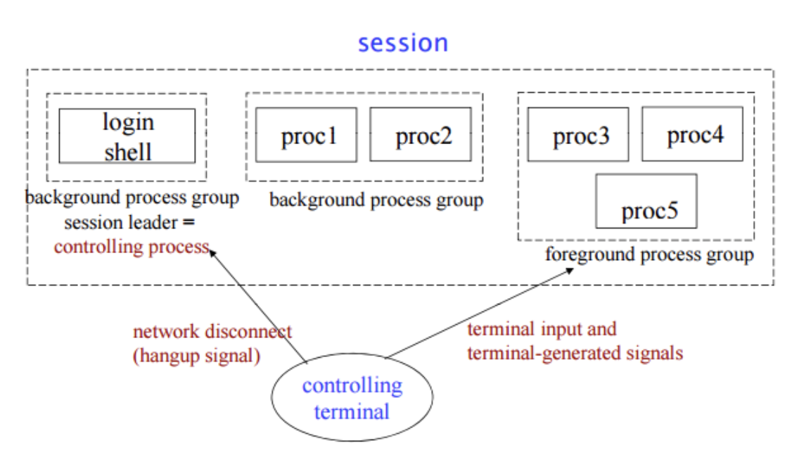
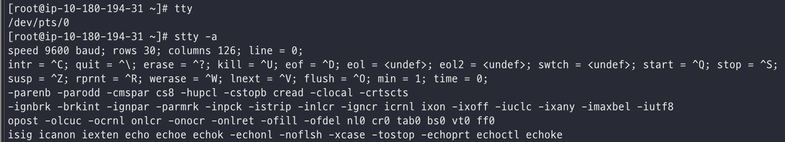

# tty

리눅스의 `/dev` 디렉토리에서 볼 수 있는 `/dev/tty*`, `/dev/pts/*` 파일들이 입출력에 관련된 파일들이며 외부 터미널 장치를 연결할 때, 리눅스에서 가상콘솔을 제공할 때 xterm이나 telnet, ssh 같은 리모트 로그인 프로그램등에 의해 사용된다.

<!--more-->

## 입출력 장치 사용의 구분

### 외부 터미널 장치 연결

* UART driver

물리적으로 bytes를 전송하는 역할을 한다. parity checks나 flow control을 수행 한다.

* Line discipline

low level 장치 드라이버 위에 line discipline이라는 레이어를 하나 더 두면 같은 장치를 여러가지 용도로 사용할 수 있다.

텍스트를 입력할 때 backspace, clear line, reprint등과 같은 line editing기능을 standard line discipline을 통해 제공한다.

* TTY driver

Session managerment기능, job control과 관련된 기능을 제공한다. 

Ctrl-z를 누르면 실행중인 job을 suspend 시키고, Ctrl-c를 누르면 종료시키고, 사용자 입력은 foreground job에만 전달되게 하고 등등은 모두 TTY driver에서 제공하는 기능이다.

### 리눅스 virtual console

OS에서 제공하는 가상콘솔이다. 실제 물리적인 장치가 연결된 것이 아니기 때문에 커널에서 터미널을 emulation한다.

line discipline, TTY driver의 기능은 위와같고 마찬가지로 background getty 프로세스에 의해 login prompt가 제공된다.

`/dev/tty{number}`파일이 사용됨.

### Pseudo TTY (xterm, telnet, ssh ...)

앞서 virtual console에서는 커널에서 터미널을 emulation했다면, TTY driver가 제공하는 session management기능과 line discipline을 그대로 사용하면서 사용자 프로그램에서 터미널을 emulation 하는 것이 PTY (Pseudo TTY) 이다.

PTY는 master/slave pair로 이뤄지는데 /dev/ptmx (pseudo-terminal master multiplexer) 파일을 open하면 pseudo terminal master(PTM)에 해당하는 file descriptor가 반환되고 pseudo terminal slave(PTS)에 해당하는 device가 `/dev/pts/` 디렉토리에 생성된다. 

두 ptm과 pts가 open하게 되면 `/dev/pts/{number}`는 실제 터미널과 같은 인터페이스를 프로세스에 제공한다.

xterm같은 터미널을 예로들면 xterm이 ptm에 연결되고 어플리케이션 프로세스 (ex. bash)가 pts에 연결되는 구조이다. xterm에서 사용자가 입력을 하면 ptm -> 커널의 line discipline -> pts를 거쳐 bash 프로세스에 전달되고, 명령 실행 결과는 다시 pts -> line discipine -> ptm을 거쳐 xterm에 전달되면 xterm은 실제 터미널과 같이 화면에 표기하게 된다.

만약 ssh접속을 했다면, stdin, stdout, stderr 모두 터미널에 연결되어 있으므로 터미널에서 ls명령을 실행하면 ssh명령의 입력으로 들어가고 네트워크를 거쳐 sshd에 전달되면 ptm -> pts -> shell로 전달된다. 명령의 실행결과는 다시 pts -> ptm -> sshd에 전달되고 네트워크를 거쳐 터미널로 출력하게 된다.

## Controlling Terminal

* controlling terminal은 session leader에 의해 할당되며 이것은 보통 `/dev/tty*`나 `/dev/pts/*`와 같은 터미널 device를 말한다.

* PID와 SID가 같은 프로세스를 session leader라고 하는데 오직 session leader만이 controlling terminal을 획득할 수 있다. session leader를 controlling process라고도 한다.

* 하나의 session은 하나의 controlling terminal만 가질 수 있다.

* session은 하나의 foreground process group과 여러개의 background process groups로 구성된다. 

* Ctrl-c를 누르면 `SIGINT`신호가 foreground process group에 전달 된다.

* network가 끊기면 `SIGHUP`신호가 session leader에 전달되고 session leader는 같은 SID를 갖는 프로세스들에게 전달한다.

## /dev/tty

`/dev/tty`는 특수 파일로 프로세스의 controlling terminal과 동일하다. 현재 ctty가 /dev/pts/12라면 /dev/tty도 /dev/pts/12와 같다고 할 수 있다.

어떤 프로세스가 /dev/tty를 open 하는데 실패하였다면 ctty를 갖고 있지 않다고 할 수 있다.

standard streams이 모두 redirect 되어 있다고 하더라도 /dev/tty로 출력하면 터미널로 출력할 수 있고 /dev/tty를 이용해 터미널로 입력 받을 수 있다. 

한가지 주의할 점은 /dev/tty로의 출력은 standard streams을 거치지 않고 직접 터미널 장치에 쓰기 때문에 메시지를 잡아서 redirect할 수 있다.

~~~bash
# /dev/tty 로의 출력은 redirect 할수없다.
$ { echo hello > /dev/tty ;} > /dev/null
hello
$ { echo hello > /dev/tty ;} 2> /dev/null
hello

# 따라서 다음과 같이 파일로 저장할 수도 없습니다.
$ cat test.sh

echo hello > /dev/tty

------------------------------
$ ./test.sh > out      # stdout
hello
$ ./test.sh 2> out     # stderr
hello
~~~

## Configuring TTY device

`tty` 명령으로 현재 shell의 tty device를 조회할 수 있고 `stty`명령을 이용해 설정 값을 변경할 수 있다.

값을 바꿀때가 있을까?? 싶긴한데 첫번째 라인의 `rows 30; columns 126;`을 보면 해당값은 TTY driver에 해당되는 값으로 터미널 프로그램의 윈도우 사이즈를 조절하면 값이 변경된다. TTY driver는 foreground job에 `SIGWINCH`신호를 보내게 된다. 

이 부분은 회사에서 bastion을 개발할 떄 사용했던 내용이라 밑부분에서 go언어로 작성 했었던 부분을 가져와서 봐보자.

다른 설정들은 그때 검색해서 확인해보면 될 듯 하다.

---

**참고**

* https://mug896.github.io/bash-shell/tty.html
